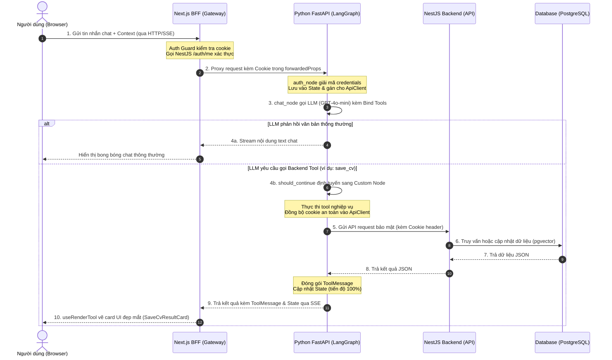

# BÁO CÁO KỸ THUẬT: HỆ THỐNG AI AGENT TRÊN NỀN TẢNG PQJOBS

Tài liệu này cung cấp báo cáo kỹ thuật chi tiết về cấu trúc, thiết kế kiến trúc, cơ chế vận hành và giải pháp cho các vấn đề kỹ thuật của module AI Agent trong dự án PQJobs. Đây là phần việc được trực tiếp phát triển và tích hợp trong hệ thống.

---

## Mục lục
1. [Giới thiệu tổng quan](#1-giới-thiệu-tổng-quan)
2. [Khái niệm nền tảng](#2-khái-niệm-nền-tảng)
3. [Kiến trúc tổng thể hệ thống Agent](#3-kiến-trúc-tổng-thể-hệ-thống-agent)
4. [Cấu trúc thư mục và vai trò từng file](#4-cấu-trúc-thư-mục-và-vai-trò-từng-file)
5. [BaseAgent — lớp nền dùng chung](#5-baseagent--lớp-nền-dùng-chung)
6. [CandidateAgent và RecruiterAgent](#6-candidateagent-và-recruiteragent)
7. [Cơ chế xác thực (Authentication) trong Agent](#7-cơ-chế-xác-thực-authentication-trong-agent)
8. [Tính năng nổi bật: Email Tool (Gmail Integration)](#8-tính-năng-nổi-bật-email-tool-gmail-integration)
9. [Tính năng: Tool tạo bài viết Blog](#9-tính-năng-tool-tạo-bài-viết-blog)
10. [Các vấn đề kỹ thuật đã gặp và cách giải quyết](#10-các-vấn-đề-kỹ-thuật-đã-gặp-và-cách-giải-quyết)
11. [Bài học kinh nghiệm rút ra](#11-bài-học-kinh-nghiệm-rút-ra)
12. [Hướng phát triển tiếp theo](#12-hướng-phát-triển-tiếp-theo)

---

## 1. Giới thiệu tổng quan

### 1.1. Vai trò của module AI Agent trong hệ thống PQJobs
Trong hệ sinh thái tìm việc và tuyển dụng **PQJobs**, module **AI Agent** đóng vai trò là trợ lý thông minh tương tác trực tiếp với người dùng qua giao diện trò chuyện tự nhiên (chat). Thay vì chỉ phản hồi các câu trả lời dạng văn bản tĩnh như chatbot truyền thống, AI Agent của PQJobs được tích hợp sâu vào hệ thống, có khả năng đọc hiểu dữ liệu hiện tại, tự động đề xuất và thực thi các nghiệp vụ nghiệp vụ cụ thể (như tìm việc, viết CV, xếp hạng ứng viên, gửi email phỏng vấn) theo thời gian thực.

### 1.2. Bài toán cần giải quyết
Hệ thống AI Agent được thiết kế nhằm giải quyết các rào cản và nâng cao trải nghiệm cho cả hai đối tượng người dùng chính:

*   **Đối với Ứng viên (Candidates):**
    *   *Khó khăn trong viết CV:* Nhiều ứng viên gặp khó khăn khi diễn đạt kinh nghiệm và học vấn một cách chuyên nghiệp. AI Agent giúp thu thập thông tin qua hội thoại, tự viết nội dung chuyên nghiệp và tự động lưu CV vào hệ thống theo mẫu thiết kế (template) được chọn.
    *   *Tìm kiếm việc làm thông minh:* Tìm kiếm từ khóa thô (lexical search) truyền thống dễ bỏ sót các công việc phù hợp. Agent hỗ trợ tìm kiếm theo ngữ nghĩa (semantic vector search) dựa trên kỹ năng và nguyện vọng của ứng viên.
*   **Đối với Nhà tuyển dụng (Recruiters):**
    *   *Quá tải hồ sơ ứng tuyển:* Việc đọc thủ công hàng chục hồ sơ rất tốn thời gian. Agent hỗ trợ phân tích và xếp hạng (rank) mức độ phù hợp của các hồ sơ với mô tả công việc (JD) bằng điểm số và lý do cụ thể.
    *   *Soạn thảo và gửi email thủ công:* Việc viết thư mời phỏng vấn, từ chối hay gửi offer mất nhiều công sức. Agent hỗ trợ tự động soạn thảo email nháp chuẩn HTML và tích hợp gửi Gmail thật trực tiếp sau khi được nhà tuyển dụng xác nhận.
    *   *Đăng tin tuyển dụng nhanh chóng:* Nhà tuyển dụng có thể trò chuyện với AI để cung cấp thông tin, AI sẽ tự động tạo tin tuyển dụng nháp (DRAFT) trên hệ thống.

---

## 2. Khái niệm nền tảng

Để xây dựng hệ thống AI Agent này, các công nghệ và khái niệm cốt lõi sau đã được áp dụng:

*   **LangGraph & StateGraph:** Là thư viện xây dựng các ứng dụng Stateful Multi-Actor với LLM. Quy trình xử lý của Agent được định nghĩa dưới dạng một đồ thị có hướng (`StateGraph`).
    *   `Node` (Nút): Là các hàm Python thực hiện một bước xử lý logic cụ thể (như xác thực, gọi LLM, thực thi công cụ).
    *   `Edge` (Cạnh): Chỉ định hướng đi cố định giữa các Node.
    *   `Conditional Edge` (Cạnh điều kiện): Đóng vai trò định tuyến (router) để rẽ nhánh luồng đi dựa trên kết quả đầu ra của Node trước đó (ví dụ: chuyển đến `tool_node` nếu LLM yêu cầu gọi tool, hoặc kết thúc đồ thị nếu LLM trả lời văn bản thông thường).
    *   `Command`: Đối tượng trong LangGraph dùng để cập nhật trạng thái (`State`) và điều khiển luồng đi động giữa các Node.
*   **CopilotKit & AG-UI Protocol:**
    *   `CopilotKit` là framework mã nguồn mở giúp kết nối đồ thị Agent ở backend với giao diện React ở frontend.
    *   `AG-UI` (Agent-Guided UI) là giao thức đồng bộ trạng thái ứng dụng thời gian thực. Trạng thái của đồ thị Agent (như tiến trình, trạng thái xử lý) được truyền tải về Frontend qua Server-Sent Events (SSE) để cập nhật giao diện, đồng thời cho phép LLM gọi các Frontend Tools và render các UI Component tùy biến (`useRenderTool`).
*   **Agent, Tool & Tool Calling:**
    *   `Agent`: Tác nhân thông minh sử dụng LLM làm não bộ để lập kế hoạch và xử lý thông tin.
    *   `Tool`: Các hàm chức năng được bọc để LLM có thể gọi.
    *   `Tool Calling`: Khả năng của LLM (như GPT-4o-mini) tự trích xuất các tham số từ yêu cầu của người dùng và quyết định gọi công cụ nào để giải quyết vấn đề.
*   **Checkpointer (AsyncPostgresSaver):** Bộ lưu vết trạng thái của LangGraph. Để các cuộc hội thoại không bị mất khi tải lại trang hoặc khởi động lại máy chủ, `AsyncPostgresSaver` lưu lại toàn bộ lịch sử tin nhắn và trạng thái đồ thị trực tiếp vào PostgreSQL theo từng phiên trò chuyện (`thread_id`).
*   **Human-in-the-loop (Con người can thiệp):** Cơ chế tạm dừng luồng chạy tự động của Agent để chờ con người kiểm tra hoặc phê duyệt. Trong dự án, cơ chế này được áp dụng thông qua thẻ xác nhận gửi email cứng trên giao diện React trước khi gọi API gửi Gmail thật.

---

## 3. Kiến trúc tổng thể hệ thống Agent

Hệ thống AI Agent được thiết kế theo mô hình **Bốn lớp chuyên biệt** nhằm đảm bảo khả năng mở rộng, bảo mật dữ liệu và tối ưu hóa trải nghiệm tương tác thời gian thực.

### 3.1. Sơ đồ luồng hoạt động tổng thể
Dưới đây là sơ đồ luồng dữ liệu khi người dùng gửi một yêu cầu trên trình duyệt:



### 3.2. Vai trò của từng lớp kiến trúc
1.  **Web Client (Frontend React):**
    *   Tích hợp Widget chat (`global-ai-chat-widget.tsx`).
    *   Đo lường và thu thập context trang web (ví dụ: người dùng đang xem trang nào, bảng dữ liệu nào) để gửi kèm request.
    *   Đăng ký các bộ render giao diện (`useRenderTool`, `useTemplateRenderer`) để vẽ các thẻ UI tương tác đẹp mắt (như danh sách công việc `JobListCard`, preview CV bằng iframe `CVPreviewInline`) khi nhận được kết quả dạng JSON từ tool, mang lại trải nghiệm premium thay vì văn bản thô.
2.  **BFF (Next.js API Route Gateway):**
    *   Lắng nghe tại endpoint `/api/copilotkit/[[...slug]]/route.ts`.
    *   Đóng vai trò là chốt chặn bảo mật (Auth Guard): Chỉ cho phép người dùng đã đăng nhập tương tác với Agent bằng cách gọi API `/auth/me` của NestJS để xác thực cookie trước khi chuyển tiếp.
    *   Tự động trích xuất cookie phiên đăng nhập từ request headers và đóng gói vào thuộc tính `forwardedProps` của body request gửi tiếp sang Python Agent.
3.  **Agent Service (Python FastAPI):**
    *   Nơi vận hành động cơ **LangGraph** chính. FastAPI đóng vai trò khởi chạy HTTP server tại cổng `8125` để nhận request streaming từ Next.js.
    *   Chia làm 2 đồ thị Agent riêng biệt: `candidate_agent` và `recruiter_agent` để tránh nhầm lẫn prompt và tối ưu hóa hiệu năng.
    *   Chuyển tiếp cookie xác thực sang lớp kết nối `ApiClient` để gọi các API nội bộ của NestJS.
4.  **NestJS Backend & Database:**
    *   Cung cấp các API nghiệp vụ cốt lõi (v1). Đảm bảo tính an toàn dữ liệu và logic nghiệp vụ của toàn bộ hệ thống.
    *   Database PostgreSQL được kích hoạt extension `pgvector` phục vụ việc tìm kiếm công việc thông minh theo vector ngữ nghĩa (so khớp cosine giữa vector keyword do Ollama sinh ra và vector của JD lưu trong bảng).

---

## 4. Cấu trúc thư mục và vai trò từng file

Cấu trúc thư mục thực tế của module AI Agent tại `web/agent/`:

```
web/agent/
├── agents/
│   ├── __init__.py
│   ├── base_agent.py          # Lớp cơ sở định nghĩa cấu trúc đồ thị Graph & logic xử lý chung
│   ├── candidate_agent.py     # Định nghĩa Candidate Agent, đăng ký tools và custom nodes của ứng viên
│   ├── recruiter_agent.py     # Định nghĩa Recruiter Agent, đăng ký tools tuyển dụng
│   └── custom_agent.py        # Kế thừa LangGraphAGUIAgent, forward cookie/token từ FE vào config
├── core/
│   ├── __init__.py
│   ├── agent_factory.py       # Khởi tạo các đồ thị Agent và cấu hình LLM (ChatOpenAI)
│   ├── api_client.py          # HTTP Client async (httpx) dùng chung, đính kèm cookie tự động
│   ├── checkpointer.py        # Thiết lập lưu vết phiên chat Postgres qua AsyncPostgresSaver
│   ├── config.py              # Đọc cấu hình từ file .env qua Pydantic Settings
│   ├── context.py             # Định nghĩa cấu trúc AgentContext (chứa metadata tĩnh)
│   └── prompts.py             # File tập trung prompts: CANDIDATE_SYSTEM_PROMPT và RECRUITER_SYSTEM_PROMPT
├── schemas/
│   ├── __init__.py
│   ├── candidate.py           # Định nghĩa CandidateState (activeWorker, progress, CV html/css...)
│   └── recruiter.py           # Định nghĩa RecruiterState (kế thừa CopilotKitState)
├── tools/
│   ├── candidate/
│   │   ├── __init__.py
│   │   ├── career_advisor.py  # Phân tích dashboard và gợi ý lộ trình nghề nghiệp
│   │   ├── choose_cv_template.py # Lấy và khớp mẫu CV theo index/tên mẫu
│   │   ├── cv_template.py     # Định nghĩa mock HTML/CSS cho template CV
│   │   ├── get_cv_detail.py   # Lấy nội dung chi tiết của một CV đã lưu
│   │   ├── list_my_cvs.py     # Liệt kê tất cả CV hiện có của ứng viên
│   │   ├── save_cv.py         # Tạo mới hoặc cập nhật thông tin CV
│   │   └── search_jobs.py     # Tìm kiếm việc làm ngữ nghĩa (gọi API vector search)
│   ├── recruiter/
│   │   ├── __init__.py
│   │   ├── create_job.py      # Đăng tin tuyển dụng nháp (DRAFT)
│   │   ├── draft_email.py     # Soạn thảo thư nháp (phỏng vấn, từ chối, offer...) chuẩn HTML
│   │   ├── get_candidates.py  # Lấy danh sách ứng viên đã nộp hồ sơ cho một job
│   │   ├── get_categories.py  # Lấy danh mục ngành nghề phục vụ đăng tin tuyển dụng
│   │   ├── rank_candidates.py # Xếp hạng hồ sơ ứng viên theo mức độ phù hợp bằng LLM độc lập
│   │   └── update_application_status.py # Cập nhật trạng thái ứng tuyển (Duyệt/Từ chối)
│   ├── shared/
│   │   ├── __init__.py
│   │   └── create_blog_post.py # Viết bài blog (dùng chung cho cả 2 Agent)
│   └── base_tool.py           # Lớp cơ sở định nghĩa StructuredTool và sync cookie an toàn
├── main.py                    # Điểm khởi chạy FastAPI, tích hợp ag_ui_langgraph và cấu hình recursion_limit
└── pyproject.toml             # File quản lý package, dependencies (Python >= 3.11)
```

---

## 5. BaseAgent — lớp nền dùng chung

Lớp `BaseAgent` ([web/agent/agents/base_agent.py](file:///f:/WebPhuQuoc/job-PhuQuoc/web/agent/agents/base_agent.py)) là trung tâm thiết lập đồ thị LangGraph và điều khiển luồng đi của mọi Agent.

### 5.1. Cơ chế StateGraph trong `base_agent.py`
Đồ thị hoạt động được khởi tạo bằng `StateGraph(state_class)`. Nó kết nối cố định 2 nút đầu tiên là `auth_node` và `chat_node`. Cấu trúc đồ thị tổng quát như sau:

```
[Start] ──► auth_node ──► chat_node ◄───┐
                             │          │
                             ▼          │
                     (should_continue)  │
                       /     │      \   │
                  __end__  tool_node ───┘
                             │
                      [custom_nodes...]
```

*   **`auth_node`:** Đọc thông tin cookie và JWT token được chuyển tiếp trong `config.configurable`. Nó cập nhật thông tin này vào `state["authorization"]` và gọi `self.api_client.set_cookie` / `set_auth_token` để chuẩn bị cho các đợt gọi API tiếp theo. Đồng thời, nó phân tích context từ CopilotKit để lấy `user_id` thật của người dùng và chuyển tiếp sang `chat_node`.
*   **`chat_node`:**
    1.  Kiểm tra xem có tin nhắn mới của người dùng hay không. Nếu không, nó kết thúc luôn (`__end__`) để giao diện hiển thị câu chào mừng mặc định.
    2.  Đọc cookie từ state và thiết lập lại cho `api_client` nhằm đảm bảo an toàn đa luồng.
    3.  Tạo prompt hệ thống hoàn chỉnh bằng cách gọi `_get_system_prompt` và kết hợp thông tin người dùng cùng dashboard context từ frontend.
    4.  Sắp xếp lại danh sách tin nhắn bằng `sanitize_tool_message_order`.
    5.  Bọc LLM với các công cụ khả dụng qua `llm.bind_tools(all_tools)`. Đặc biệt, đối với ChatOpenAI, tham số `parallel_tool_calls=False` được áp dụng để ép LLM gọi tuần tự từng tool một, giúp theo dõi trạng thái tiến trình (progress bar) trên frontend mượt mà hơn.
    6.  Gọi LLM và cập nhật kết quả tin nhắn mới vào `messages`.
*   **`should_continue` (Cạnh điều kiện):** Kiểm tra tin nhắn cuối cùng từ LLM.
    *   Nếu LLM không yêu cầu gọi tool, hoặc yêu cầu gọi **Frontend Tool** (như `send_email` qua useHumanInTheLoop), đồ thị sẽ đi thẳng tới `__end__` để chuyển giao quyền kiểm soát cho Frontend.
    *   Nếu LLM yêu cầu gọi **Backend Tool**, nó kiểm tra xem tên tool đó có nằm trong bản đồ định tuyến tùy biến `_get_routing_map()` hay không. Nếu có, nó chuyển tiếp tới custom node tương ứng (ví dụ: `save_cv_node`). Nếu không, nó đi vào `tool_node` chuẩn của LangChain.

### 5.2. Tại sao cần Custom Node thay vì dùng ToolNode chuẩn?
LangGraph cung cấp lớp `ToolNode` có sẵn để tự động thực thi các tool. Tuy nhiên, PQJobs đã **tắt hoàn toàn** cơ chế này đối với các tool tương tác với cơ sở dữ liệu (`_get_lc_tools_for_toolnode` trả về `[]`) và thay thế bằng các Custom Node (đăng ký qua hàm `as_node` trong từng tool). Lý do kỹ thuật:
1.  **Lỗi xác thực (Authentication):** `ToolNode` chuẩn của LangChain chỉ nhận tham số từ schema và gọi hàm `run()`. Nó hoàn toàn không có quyền truy cập vào `state` hay `config` của LangGraph. Vì vậy, tool không có cách nào biết được cookie xác thực của request đang chạy để truyền cho `ApiClient`.
2.  **Thông báo tiến trình (State Emit):** Các custom node cho phép ta cập nhật trạng thái tiến trình thời gian thực (`activeWorker`, `currentStep`, `progress`) vào `state` và chủ động gọi `copilotkit_emit_state(config, state)` gửi về client. Điều này giúp thanh tiến trình trên giao diện chat React chạy mượt mà và không gây cảm giác ứng dụng bị treo.

### 5.3. Vai trò của hàm `sanitize_tool_message_order`
OpenAI quy định rất nghiêm ngặt về thứ tự tin nhắn gửi lên API: Bất kỳ `AIMessage` nào có thuộc tính `tool_calls` (yêu cầu gọi công cụ) bắt buộc phải được theo sau ngay lập tức bởi các `ToolMessage` tương ứng (phản hồi kết quả của công cụ đó) trước khi có thêm tin nhắn AI khác.

Tuy nhiên, LangGraph checkpointer khi merge danh sách tin nhắn đôi khi làm xáo trộn thứ tự hoặc đẩy các `ToolMessage` xuống cuối danh sách. Khi đó, OpenAI API sẽ trả về lỗi **HTTP 400 Bad Request** với nội dung: `"tool_call_ids did not have response messages"` và làm crash stream trò chuyện.

Hàm `sanitize_tool_message_order` giải quyết triệt để lỗi này bằng cách quét qua danh sách tin nhắn:
*   Tách riêng các `ToolMessage` ra và lưu vào dictionary theo `tool_call_id`.
*   Tái cấu trúc lại mảng kết quả: Duyệt qua các tin nhắn, hễ gặp `AIMessage` có chứa `tool_calls`, nó sẽ chủ động chèn các `ToolMessage` tương ứng ngay phía sau nó.
*   Nếu phát hiện một tool_call bị "mồ côi" (không tìm thấy kết quả thực thi trong danh sách tin nhắn cũ, ví dụ do lỗi mạng làm gián đoạn giữa chừng), hàm sẽ tự động chèn một `ToolMessage` rỗng dự phòng với nội dung `"Không có kết quả (tool chưa hoàn tất)."` để tránh làm crash API OpenAI ở lượt gọi tiếp theo.

---

## 6. CandidateAgent và RecruiterAgent

### 6.1. CandidateAgent
*   **Danh sách Tool:**
    1.  `analyze_candidate_dashboard`: Phân tích tình trạng hồ sơ hiện tại và gợi ý hành động tiếp theo.
    2.  `search_jobs`: Tìm kiếm việc làm thông minh bằng vector search (cosine similarity).
    3.  `list_my_cvs`: Lấy danh sách CV ứng viên đã tạo.
    4.  `get_cv_detail`: Xem chi tiết thông tin một CV cụ thể.
    5.  `choose_cv_template`: Khớp và chọn mẫu giao diện CV.
    6.  `save_cv`: Lưu thông tin hoặc tạo mới CV chuyên nghiệp.
    7.  `create_blog_post`: Tạo bài viết blog chia sẻ kinh nghiệm tìm việc.
*   **Thiết kế System Prompt:** Định hình vai trò AI là Candidate Agent duy nhất. Ép LLM tuân thủ: chỉ truyền tham số `location` cho `search_jobs` khi người dùng chủ động yêu cầu địa điểm cụ thể trong tin nhắn hiện tại (không tự ý lấy từ profile). Quy đổi tiền lương sang đơn vị đồng (VND). Không được in danh sách việc làm dạng text sau khi gọi `search_jobs` vì giao diện đã có card hiển thị đẹp mắt.
*   **Sơ đồ use case tiêu biểu:**

#### Use Case 1: Luồng tạo CV mới
```mermaid
graph TD
    A[Ứng viên: "Tạo CV giúp tôi"] --> B[AI: Thu thập họ tên, email, sđt, học vấn, kinh nghiệm]
    B --> C[AI gọi choose_cv_template để lấy danh sách mẫu]
    C --> D[AI liệt kê có đánh số thứ tự & hỏi ứng viên chọn mẫu]
    D --> E[Ứng viên chọn: "Mẫu số 2"]
    E --> F[AI gọi choose_cv_template để lấy template_id]
    F --> G[AI tự viết lại tóm tắt & kinh nghiệm theo văn phong chuyên nghiệp]
    G --> H[AI gọi save_cv kèm template_id & thông tin]
    H --> I[Render SaveCvResultCard kèm nút Xem CV trên UI]
```

#### Use Case 2: Luồng tìm kiếm công việc
```mermaid
graph TD
    A[Ứng viên: "Tìm việc NodeJS lương trên 10 triệu ở Dương Đông"] --> B[AI gọi search_jobs]
    B --> C[Tool gọi Ollama chuyển 'NodeJS' thành vector embedding]
    C --> D[Gửi vector + lương 10000000 + địa điểm Dương Đông đến API]
    D --> E[Database pgvector thực hiện so khớp cosine trả về danh sách jobs]
    E --> F[AI phản hồi: 'Mình tìm được vài việc phù hợp, bạn xem thử bên dưới nhé']
    F --> G[Render JobListCard hiển thị các công việc trực quan]
```

---

### 6.2. RecruiterAgent
*   **Danh sách Tool:**
    1.  `get_candidates`: Xem hồ sơ các ứng viên đã nộp đơn.
    2.  `rank_candidates`: Đánh giá và xếp hạng ứng viên bằng AI độc lập.
    3.  `update_application_status`: Duyệt (ACCEPTED) hoặc Từ chối (REJECTED) hồ sơ.
    4.  `draft_email`: Soạn nội dung email HTML mẫu gửi ứng viên.
    5.  `send_email` (Frontend Tool): Gửi email thật qua Gmail.
    6.  `get_categories`: Lấy danh mục ngành nghề.
    7.  `create_job`: Đăng tin tuyển dụng nháp.
    8.  `create_blog_post`: Viết bài blog chia sẻ kinh nghiệm tuyển dụng.
*   **Thiết kế System Prompt:** Định hình vai trò AI trợ lý tuyển dụng. Quy định: nếu `get_candidates` trả về danh sách rỗng thì dừng lại ngay, báo cho nhà tuyển dụng biết chứ không tự gọi lại nhiều lần. Ép tách tham số ngày giờ và địa điểm phỏng vấn ra khỏi `additional_info` khi soạn mail để hiển thị thành một khối thông tin nổi bật trong email. Giải thích cho nhà tuyển dụng hạn nộp hồ sơ sẽ tự set sau thanh toán và không được hỏi deadline khi tạo job.
*   **Sơ đồ use case tiêu biểu:**

#### Use Case 1: Luồng xếp hạng ứng viên
```mermaid
graph TD
    A[Nhà tuyển dụng: "Xếp hạng ứng viên nộp cho Job X"] --> B[AI gọi rank_candidates]
    B --> C[Lấy JD của Job X qua API NestJS]
    C --> D[Lấy thông tin CV chi tiết của tất cả ứng viên nộp đơn]
    D --> E[Dựng prompt phân tích & gọi scoring LLM độc lập chấm điểm 0-100]
    E --> F[AI sắp xếp và trả về danh sách xếp hạng kèm điểm & lý do phù hợp]
    F --> G[Hiển thị thứ tự xếp hạng chi tiết bằng văn bản trong khung chat]
```

#### Use Case 2: Luồng đăng tin tuyển dụng nháp
```mermaid
graph TD
    A[Nhà tuyển dụng: "Đăng tin tuyển dụng mới"] --> B[AI gọi get_categories lấy danh mục ngành nghề]
    B --> C[AI hiển thị danh sách ngành nghề & hỏi nhà tuyển dụng chọn]
    C --> D[Nhà tuyển dụng cung cấp thông tin: Tiêu đề, mô tả, lương, cấp bậc]
    D --> E[AI tóm tắt thông tin & hỏi xác nhận]
    E --> F[AI gọi create_job gửi payload lên NestJS]
    F --> G[API lưu job ở trạng thái DRAFT]
    G --> H[AI thông báo thành công & hướng dẫn vào trang thanh toán chọn gói đăng tin để kích hoạt]
```

---

## 7. Cơ chế xác thực (Authentication) trong Agent

Để đảm bảo an toàn thông tin, mọi yêu cầu truy xuất dữ liệu từ Agent tới backend NestJS đều phải đi kèm cookie session của người dùng đang đăng nhập.

### 7.1. ApiClient — Thiết kế Singleton và an toàn đa luồng
Lớp `ApiClient` ([web/agent/core/api_client.py](file:///f:/WebPhuQuoc/job-PhuQuoc/web/agent/core/api_client.py)) đóng vai trò bọc `httpx.AsyncClient` để gửi request HTTP lên NestJS Backend. Để tối ưu hóa hiệu năng và quản lý kết nối hiệu quả, `ApiClient` được thiết kế dưới dạng một đối tượng dùng chung (Singleton) được khởi tạo một lần duy nhất lúc máy chủ FastAPI chạy (`lifespan`).

**Rủi ro tranh chấp tài nguyên (Concurrency Race Condition):**
Vì `ApiClient` là một instance duy nhất dùng chung cho mọi luồng request của mọi người dùng đang chat song song, việc gán cookie bằng `self.api_client.set_cookie(cookie)` trực tiếp trên instance này có rủi ro rất lớn: Request của User A có thể ghi đè cookie của User B nếu hai người chat cùng một thời điểm, dẫn tới rò rỉ dữ liệu chéo hoặc lỗi phân quyền.

**Giải pháp xử lý triệt để:**
1.  **Quy tắc "Không await xen giữa":** Trong LangGraph, mỗi khi một Node Tool thực thi, hàm `as_node` sẽ gọi:
    ```python
    tool_instance.sync_auth_from_state(state)
    result = await tool_instance.run(...)
    ```
    Hàm `sync_auth_from_state` đọc cookie từ state riêng của request hiện tại và gán vào `api_client._cookie`. Vì thao tác gán cookie này và việc tạo headers trong `ApiClient._get_headers()` xảy ra hoàn toàn đồng bộ (không chứa từ khóa `await`), theo cơ chế Single-Thread Event Loop của Python asyncio, luồng xử lý sẽ không bao giờ chuyển sang task khác ở giữa hai bước này. Do đó, cookie gán vào request HTTP gửi đi luôn thuộc về đúng user đang chạy node đó mà không bị task khác ghi đè giữa chừng.
2.  **Không sử dụng ContextVars:** LangGraph có thể thực thi các Node khác nhau trong các asyncio Task riêng biệt, khiến dữ liệu lưu trong ContextVar không thể lan truyền chính xác từ `auth_node` sang các Tool Node phía sau, dẫn tới việc mất cookie và ném lỗi 401. Việc lưu cookie vào Graph State và đồng bộ trực tiếp trước mỗi cuộc gọi là giải pháp đáng tin cậy nhất.

### 7.2. Luồng truyền Cookie từ trình duyệt đến NestJS Backend
Sơ đồ mô tả luồng đi của Cookie xác thực:

```
┌──────────────┐                  ┌────────────────┐                  ┌──────────────┐
│  Trình duyệt │                  │  Next.js BFF   │                  │ Python Agent │
│  (Session)   │                  │  (Middleware)  │                  │  (LangGraph) │
└──────┬───────┘                  └───────┬────────┘                  └──────┬───────┘
       │                                  │                                  │
       │─── Gửi request chat + Cookie ───►│                                  │
       │    (HTTP POST /api/copilotkit)   │                                  │
       │                                  │─── Trích cookie & đóng gói vào ──►│
       │                                  │    forwardedProps.cookie (JSON)  │
       │                                  │                                  │ (FastAPI nhận)
       │                                  │                                  │ CustomLangGraphAGUIAgent
       │                                  │                                  │ trích ra gán vào
       │                                  │                                  │ config.configurable["cookie"]
       │                                  │                                  │
       │                                  │                                  │ (LangGraph Graph chạy)
       │                                  │                                  │ auth_node đọc config
       │                                  │                                  │ lưu vào state["authorization"]
       │                                  │                                  │
       │                                  │                                  │ (Tool Node chạy)
       │                                  │                                  │ sync_auth_from_state đọc
       │                                  │                                  │ state gán vào api_client
       │                                  │                                  │
       │                                  │◄─── Gửi request HTTP API ────────│
       │                                  │     (Header Cookie đính kèm)     │
       │                                  │                                  │
```

---

## 8. Tính năng nổi bật: Email Tool (Gmail Integration)

### 8.1. Kiến trúc tổng thể và OAuth Flow
Để gửi email thật đại diện cho nhà tuyển dụng, hệ thống tích hợp dịch vụ Gmail thông qua giao thức OAuth 2.0.

*   **Tách biệt mô hình dữ liệu (`EmailIntegration`):** Bảng `EmailIntegration` lưu thông tin kết nối OAuth (access token, refresh token, email liên kết) được tách riêng hoàn toàn khỏi bảng tài khoản cốt lõi (`account` của thư viện better-auth). Điều này giúp:
    1.  Không can thiệp vào cấu trúc nội bộ của thư viện better-auth, tránh lỗi khi nâng cấp thư viện.
    2.  Phân tách phạm vi quyền hạn (OAuth scopes): Khi đăng ký/đăng nhập, ứng dụng chỉ yêu cầu quyền cơ bản (email, profile). Quyền gửi thư rộng (`gmail.send`) chỉ được yêu cầu khi nhà tuyển dụng chủ động bấm kết nối Gmail trong cài đặt, tránh làm người dùng lo sợ về quyền riêng tư ngay từ bước đầu.
*   **Cơ chế gửi thư chuẩn MIME:** Email được NestJS backend xây dựng dưới dạng nội dung raw MIME `multipart/alternative` đáp ứng chuẩn quốc tế:
    *   Tiêu đề email (Subject) được mã hóa theo chuẩn **RFC 2047** (`=?UTF-8?B?...?=`) giúp hiển thị tiếng Việt có dấu chính xác trên mọi ứng dụng email client (như Outlook, Gmail, Apple Mail) mà không bị lỗi font.
    *   Nội dung thư được mã hóa Base64 và tự động ngắt dòng sau mỗi 76 ký tự theo chuẩn **RFC 2045** (`base64Wrap`).
    *   Một hàm tự động tách và loại bỏ các thẻ HTML (`stripHtml`) để tạo một bản text thuần (`text/plain`) đính kèm song song với bản HTML (`text/html`). Điều này giúp tránh bị các bộ lọc thư rác (spam filters) đánh giá điểm spam cao (thường phạt nặng các email HTML mà không có bản text thuần đi kèm).

### 8.2. Tại sao gửi email phải là FRONTEND Tool?
Trong LangGraph kết hợp FastAPI, cơ chế tạm dừng đồ thị (`interrupt()`) để chờ tín hiệu xác nhận từ phía người dùng không được hỗ trợ mượt mà trong giao thức stream trực tiếp. Nếu cố tình thực hiện gửi email trực tiếp từ Backend Python, ta sẽ gặp 2 vấn đề lớn:
1.  **Race Condition & Timeout:** Đồ thị sẽ bị treo ở trạng thái chờ xác nhận, dễ dẫn tới timeout kết nối SSE của CopilotKit.
2.  **Bảo mật:** Gửi email thật là hành động nhạy cảm, nếu để AI hoàn toàn tự động quyết định và tự gọi API gửi đi từ backend mà không có sự kiểm duyệt của con người thì rủi ro rất cao (ví dụ AI hiểu lầm ý hoặc tự gửi thư từ chối nhầm cho ứng viên).

**Giải pháp thiết kế:**
Công cụ `send_email` được đăng ký hoàn toàn ở **Frontend React** thông qua hook `useHumanInTheLoop`:
*   AI chỉ gọi backend tool `draft_email` để soạn thảo nội dung HTML mẫu, sau đó đề xuất gọi frontend tool `send_email`.
*   CopilotKit Client bắt sự kiện gọi `send_email` và chặn lại, hiển thị thẻ xác nhận gửi email cứng (`SendEmailConfirmCard`) có giao diện xem trước nội dung email mẫu trong iframe sandboxed và hai nút bấm vật lý: **Xác nhận gửi** và **Hủy**.
*   Chỉ khi người dùng tự tay nhấn "Xác nhận gửi", trình duyệt mới thực sự kích hoạt hàm gọi API NestJS `/api/v1/email-integration/send` để gửi thư thật đi qua tài khoản Gmail của họ, hoàn toàn bỏ qua Python Agent ở bước thực thi. Đây là giải pháp **Human-in-the-loop** an toàn và tối ưu nhất.

---

## 9. Tính năng: Tool tạo bài viết Blog

### 9.1. Vai trò dùng chung của Tool
Công cụ `create_blog_post` ([web/agent/tools/shared/create_blog_post.py](file:///f:/WebPhuQuoc/job-PhuQuoc/web/agent/tools/shared/create_blog_post.py)) là một tool dùng chung cho cả 2 agent. Vì backend API `/blogs` (POST) cho phép bất kỳ người dùng nào (Ứng viên, Nhà tuyển dụng) đăng bài viết chia sẻ, nên tool được đặt ở thư mục `tools/shared/` để tránh trùng lặp mã nguồn, trong khi mỗi agent vẫn tự khai báo định tuyến node riêng trên đồ thị của mình.

### 9.2. Tự dựng cấu trúc Tiptap JSON từ tham số có cấu trúc
Trình soạn thảo bài viết ở frontend PQJobs sử dụng thư viện **Tiptap** (dựa trên ProseMirror). Tiptap lưu trữ nội dung dưới dạng một cây đối tượng JSON phức tạp (Node & Mark schema).

Nếu ta để LLM tự viết và trả về chuỗi JSON Tiptap thô, tỉ lệ lỗi rất cao do:
*   LLM viết sai tên node (ví dụ viết `paragraph` thành `p`, `bulletList` thành `ul`).
*   Lồng sai cấu trúc cấp độ (như đặt `listItem` trực tiếp dưới `doc` mà không có `bulletList`).
*   Thiếu các thuộc tính bắt buộc khiến trình soạn thảo ở frontend bị crash khi tải trang.

**Giải pháp thiết kế:**
Tool định nghĩa một schema đầu vào đơn giản và có cấu trúc chặt chẽ (`BlogSectionInput`):
*   LLM chỉ cần trả về danh sách các khối nội dung phẳng (`sections`) với thuộc tính `type` (`heading2`, `heading3`, `paragraph`, `bullet_list`, `ordered_list`) và nội dung chữ hoặc mảng các mục (`items`).
*   Backend Python sử dụng hàm `_build_tiptap_doc` để tự động xây dựng cây Tiptap JSON chuẩn xác tuyệt đối:
    *   Tự động bọc danh sách mục vào thẻ `bulletList` / `orderedList` và từng thẻ `listItem` lồng thẻ `paragraph` bên trong.
    *   Tự động escape các ký tự đặc biệt.
    *   Nếu bài viết rỗng, hàm tự động chèn một đoạn văn rỗng mặc định `[{"type": "paragraph"}]` để khớp với schema khởi tạo của Tiptap, tránh lỗi crash backend.

---

## 10. Các vấn đề kỹ thuật đã gặp và cách giải quyết

Trong quá trình phát triển và tích hợp hệ thống AI Agent, nhiều thách thức kỹ thuật phức tạp đã được phát hiện và xử lý thành công:

### 10.1. Vòng lặp gọi tool vô hạn (GraphRecursionError)
*   **Vấn đề:** Trong một số tình huống (như tìm việc không ra kết quả), LLM OpenAI liên tục gọi đi gọi lại một tool với các tham số tương tự nhau mà không chịu dừng lại để hỏi ý kiến người dùng. Điều này dẫn đến việc tiêu tốn rất nhiều lượt gọi API OpenAI thật và cuối cùng bị ngắt bởi lỗi vượt quá số bước tối đa (mặc định 25 bước của LangGraph).
*   **Nguyên nhân:** Đã thử cấu hình `recursion_limit` trong hàm `prepare_stream()` của agent hoặc gọi `.with_config()` trên compiled graph nhưng không có tác dụng. Lý do là thư viện `ag_ui_langgraph` tự dựng lại cấu hình riêng cho đồ thị khi stream sự kiện SSE, làm mất cấu hình giới hạn bước đã gán ở các lớp bọc ngoài.
*   **Cách giải quyết:** Truyền trực tiếp tham số `config=RunnableConfig(recursion_limit=12)` ngay tại constructor khởi tạo của `LangGraphAGUIAgent` (lớp cha của `CustomLangGraphAGUIAgent`) trong `main.py`. Đây là cấu hình nội bộ được lưu giữ bên trong đối tượng agent và được áp dụng khi tự gọi stream, giúp khống chế số bước tối đa là 12 một cách an toàn.

### 10.2. Lỗi `agentId` không khớp khiến tool không được nhận diện
*   **Vấn đề:** Giao diện React ở frontend báo lỗi không tìm thấy tool `send_email` khi LLM muốn gọi, mặc dù tool đã được khai báo đầy đủ.
*   **Nguyên nhân:** `agentId` truyền vào hook `useHumanInTheLoop` ở frontend bị khai báo nhầm thành `"recruiter_agent"` (là tên nội bộ của graph đăng ký bên FastAPI) thay vì phải khớp với key định nghĩa trong đối tượng `agents` truyền cho `CopilotRuntime` ở Next.js route.ts (là `"recruiter"`). Sự sai lệch này khiến frontend tool không thể đăng ký thành công vào đúng phiên agent đang chạy.
*   **Cách giải quyết:** Điều chỉnh `agentId: "recruiter"` trong `job-tools-renderer.tsx` để khớp chính xác với BFF Gateway.

### 10.3. Lỗi vượt quá giới hạn token ngữ cảnh (OpenAIContextOverflowError)
*   **Vấn đề:** Khi nhà tuyển dụng yêu cầu xếp hạng ứng viên cho các công việc có lượng hồ sơ lớn, prompt gửi lên LLM vượt quá giới hạn token (Context Overflow) và làm crash yêu cầu.
*   **Nguyên nhân:** Đưa toàn bộ dữ liệu CV thô, chi tiết của hàng chục ứng viên vào prompt phân tích.
*   **Cách giải quyết:**
    1.  Đặt giới hạn phân tích tối đa `MAX_CANDIDATES_TO_ANALYZE = 30` ứng viên trong một lượt.
    2.  Chỉ trích xuất các trường thông tin cần thiết nhất (học vấn, kinh nghiệm, kỹ năng, bằng cấp) và chuyển đổi thành chuỗi JSON rút gọn qua hàm `_format_resume_field` thay vì gửi toàn bộ object dữ liệu CV cồng kềnh.

### 10.4. Lỗi timeout do tác vụ nặng bị coi là treo (Timeout Issue #2059)
*   **Vấn đề:** Khi chạy tác vụ xếp hạng ứng viên (phải gọi API lấy danh sách rồi gọi OpenAI chấm điểm cho 30 ứng viên mất nhiều giây), CopilotKit ở trình duyệt tự ngắt kết nối stream với lỗi `INCOMPLETE_STREAM` dù Python Agent vẫn đang xử lý bình thường.
*   **Nguyên nhân:** CopilotKit runtime mặc định coi một lượt chạy tool là "bị treo" nếu không nhận được bất kỳ tín hiệu cập nhật trạng thái nào từ backend trong một khoảng thời gian ngắn.
*   **Cách giải quyết:** Thiết kế hàm `_heartbeat()` trong `RankCandidatesTool`. Hàm này gọi `copilotkit_emit_state(config, state)` để liên tục gửi các tín hiệu cập nhật tiến độ (ví dụ: 65%, 80%) về frontend sau mỗi bước xử lý dài (sau khi gọi API lấy JD, sau khi lấy danh sách ứng viên, và trước khi gọi LLM chấm điểm), giúp duy trì kết nối luôn "sống".

### 10.5. Tráo đổi thứ tự tin nhắn lỗi HTTP 400 từ OpenAI API
*   **Vấn đề:** Hệ thống crash bất ngờ với lỗi `400 Bad Request` từ OpenAI API báo thiếu tin nhắn phản hồi cho tool_call.
*   **Nguyên nhân:** LangGraph checkpoint lưu trữ tin nhắn đôi khi làm xáo trộn vị trí của `ToolMessage` khiến nó không nằm ngay sau `AIMessage` tương ứng có yêu cầu gọi tool.
*   **Cách giải quyết:** Tích hợp hàm `sanitize_tool_message_order` vào đầu `chat_node` để tự động sắp xếp lại danh sách tin nhắn trước khi gửi sang OpenAI API, đồng thời tự sinh `ToolMessage` rỗng dự phòng cho các tool call chưa hoàn thành.

### 10.6. Sidebar danh sách chat hiển thị sai thứ tự và nhảy thread
*   **Vấn đề:** Khi gửi tin nhắn mới ở thread hiện tại, danh sách thread bên sidebar không tự động đẩy thread đó lên đầu trang, và khi người dùng đổi tab rồi quay lại, giao diện đột ngột nhảy sang thread khác.
*   **Nguyên nhân:** Thiếu cờ `invalidateQueries` cho `touchMutation` trong React Query cache. Mặc dù backend đã cập nhật trường `updatedAt` của thread chính xác, cache React Query ở frontend vẫn giữ nguyên thứ tự cũ, dẫn tới bất đồng bộ trạng thái khi cache được refresh muộn.
*   **Cách giải quyết:** Thêm `onSuccess: () => queryClient.invalidateQueries({ queryKey })` cho `touchMutation` trong hook `useChatThreads` (`use-chat-threads.ts`).

---

## 11. Bài học kinh nghiệm rút ra

1.  **Về thiết kế hệ thống Multi-Agent:**
    *   Việc chia nhỏ Agent thành các thực thể độc lập (`candidate_agent`, `recruiter_agent`) giúp cấu trúc prompt gọn gàng, giảm thiểu rủi ro LLM bị "nhầm vai" và dễ dàng mở rộng các tool chuyên biệt mà không ảnh hưởng tới Agent còn lại.
    *   Tách biệt vai trò của BFF Next.js (gateway, auth guard) và Python Agent (logic đồ thị, AI) giúp hệ thống bảo mật hơn và tận dụng tối đa thế mạnh xử lý giao diện của JS và xử lý AI của Python.
2.  **Về gỡ lỗi (debugging) hệ thống real-time/streaming:**
    *   Các lỗi liên quan đến stream kết nối (SSE) và bất đồng bộ trạng thái rất khó phát hiện qua log thông thường. Việc thiết lập hệ thống log chi tiết và vẽ sơ đồ luồng hoạt động giúp xác định nhanh nguyên nhân nghẽn kết nối hoặc timeout.
    *   Cơ chế phát tín hiệu tiến độ chủ động (`copilotkit_emit_state`) không chỉ cải thiện UX mà còn là giải pháp kỹ thuật cần thiết để duy trì kết nối TCP không bị ngắt quãng bởi các proxy hoặc gateway trung gian.
3.  **Về bảo mật và Concurrency:**
    *   Khi làm việc với các thư viện bất đồng bộ (asyncio) trong Python, tuyệt đối tránh lưu trữ trạng thái của request riêng biệt (như cookie người dùng) vào các biến toàn cục hoặc instance dùng chung (Singleton) nếu có các điểm `await` ở giữa. Luôn đảm bảo tính nguyên tử (atomic) của các thao tác thiết lập cấu hình.
    *   Đối với các hành động có thể gây ảnh hưởng thực tế (như gửi email thật, thay đổi trạng thái hồ sơ), cơ chế xác nhận trực quan (Human-in-the-loop) là bắt buộc để ngăn chặn các sai lầm không đáng có của AI.

---

## 12. Hướng phát triển tiếp theo

Dựa trên các phần ghi chú và hiện trạng mã nguồn, các hướng nâng cấp tiềm năng bao gồm:

1.  **Cá nhân hóa Prompt động cho Ứng viên:** Fetch trực tiếp hồ sơ thật của ứng viên từ NestJS Backend thông qua API để cá nhân hóa system prompt của `CandidateAgent` (nạp kỹ năng, năm kinh nghiệm thật) thay vì sử dụng context tĩnh rỗng lúc khởi động.
2.  **Tích hợp bộ đọc hiểu file PDF (PDF Parser):** Hiện tại, khi ứng viên nộp hồ sơ bằng file PDF tải lên, công cụ `rank_candidates` chưa đọc được nội dung chi tiết mà chỉ dựa vào Cover Letter. Nâng cấp tiếp theo sẽ tích hợp thư viện OCR/PDF parsing (như PyMuPDF hoặc LayoutParser) ở backend để trích xuất text từ file PDF trước khi đưa vào LLM chấm điểm.
3.  **AI tự động sinh ảnh cho bài viết Blog:** Tích hợp công cụ sinh ảnh (như DALL-E hoặc Stable Diffusion cục bộ) vào tool `create_blog_post` để tự động tạo ảnh đại diện bài viết nghệ thuật và upload trực tiếp lên CDN (như Cloudinary).
4.  **Tối ưu hóa tìm kiếm Hybrid Search:** Kết hợp tìm kiếm vector hiện tại với tìm kiếm từ khóa truyền thống (Full-Text Search của PostgreSQL) để tăng độ chính xác của kết quả gợi ý công việc cho ứng viên.
