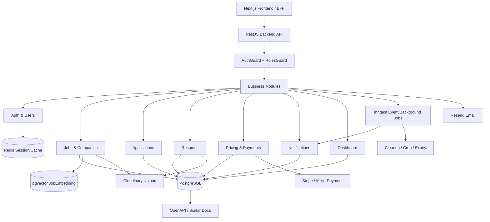

# Báo Cáo Tiến Độ Backend Và Database

## 1. Thông Tin Tổng Quan

**Dự án:** Phú Quốc Jobs - nền tảng tuyển dụng tập trung cho khu vực Phú Quốc.

**Vai trò em phụ trách:** thiết kế database, xây dựng Backend API, tổ chức kiến trúc module, tích hợp các dịch vụ hạ tầng phụ trợ và hỗ trợ Frontend kết nối dữ liệu.

**Công nghệ chính đã sử dụng:**

| Nhóm | Công nghệ | Vai trò trong hệ thống |
|---|---|---|
| Backend framework | NestJS, TypeScript | Xây dựng REST API, guard, module nghiệp vụ |
| ORM/Database | Prisma, PostgreSQL | Thiết kế schema, migration, query dữ liệu |
| AI Search | pgvector | Lưu embedding việc làm để hỗ trợ tìm kiếm ngữ nghĩa/RAG |
| Auth/Session | better-auth, Redis | Đăng nhập, session, phân quyền Candidate/Employer/Admin |
| Async job | Inngest | Xử lý notification, cron, cleanup, job expiry, summary nền |
| Payment | Stripe và mock payment | Gói thanh toán, kích hoạt tin đăng sau thanh toán |
| Upload | Cloudinary | Upload CV, logo công ty, ảnh đại diện |
| Email | Resend | Gửi email/OTP/thông báo theo cấu hình |
| API Docs | OpenAPI/Scalar | Tài liệu hóa và test API |

Backend hiện tại được thiết kế theo hướng **Modular Monolith**: chưa tách microservice sớm, nhưng các domain nghiệp vụ đã được tách thành module riêng để dễ bảo trì và có thể tách service khi cần scale.

---

## 2. Lý Do Lựa Chọn Công Nghệ Backend

Khi thiết kế Backend, em không chỉ chọn công nghệ theo mức độ phổ biến mà dựa trên nhu cầu thực tế của dự án: cần phát triển nhanh cho đồ án, dễ demo, dễ bảo trì, có đường nâng cấp production nhỏ, đồng thời đủ tốt cho các nghiệp vụ tuyển dụng như đăng tin, ứng tuyển, thanh toán, thông báo và AI search.

| Công nghệ | Cách hoạt động trong hệ thống | Vì sao chọn | Ưu điểm | Hạn chế / cách kiểm soát |
|---|---|---|---|---|
| NestJS | Tổ chức backend thành module, controller, provider/service, guard, interceptor | Dự án có nhiều domain nghiệp vụ nên cần framework có cấu trúc rõ ràng | Hợp với Modular Monolith, Dependency Injection tốt, guard/pipe/interceptor đầy đủ, dễ tách module khi team lớn hơn | Ban đầu nhiều boilerplate hơn Express; cần thống nhất convention module |
| Prisma | Khai báo schema, relation, migration và sinh Prisma Client để query DB | Backend cần type-safe query và schema dễ đọc/review | Giảm lỗi query thủ công, relation rõ, migration có lịch sử SQL | Một số tính năng DB đặc thù cần raw SQL hoặc migration tùy chỉnh |
| PostgreSQL | Database quan hệ chính, lưu toàn bộ dữ liệu nghiệp vụ | Dữ liệu tuyển dụng có quan hệ chặt: user, company, job, application, payment | ACID, foreign key, index, transaction, phù hợp dữ liệu nghiệp vụ | Cần thiết kế index và theo dõi slow query khi dữ liệu tăng |
| pgvector | Extension PostgreSQL để lưu vector embedding trong bảng `job_embedding` | Muốn hỗ trợ semantic search/RAG mà không phải vận hành thêm vector database riêng | Lưu vector cùng dữ liệu job, vẫn dùng JOIN/filter của PostgreSQL | Khi dữ liệu vector lớn cần ANN index như HNSW/IVFFlat và benchmark truy vấn |
| Redis | Lưu cache/session ngắn hạn, hỗ trợ truy cập nhanh | Session/cache không nên đặt toàn bộ lên PostgreSQL | Tốc độ cao, có TTL, phù hợp session/cache | Dữ liệu có thể mất nếu không cấu hình persistence; không dùng làm nguồn dữ liệu chính |
| Inngest | Nhận event/cron/webhook rồi chạy function nền có retry và step checkpoint | Các tác vụ như notification, job expiry, cleanup không nên block API request | Dễ viết workflow nền, retry tự động, cron dễ debug hơn Kafka trong giai đoạn nhỏ | Không thay thế Kafka cho event streaming khối lượng rất lớn; cần idempotency cho handler |
| Stripe/mock payment | Tạo luồng thanh toán package/job activation | Dự án cần mô phỏng và có đường tích hợp thanh toán thật | Stripe có Checkout/API/webhook rõ ràng, mock giúp demo không phụ thuộc giao dịch thật | Webhook cần kiểm soát idempotency, signature, transaction |
| Cloudinary | Backend upload file lên Cloudinary và lưu URL/public id | File CV/logo/avatar không nên lưu trong server local | Có upload API, transformation ảnh, CDN delivery | Cần validate file type/size và quản lý xóa file cũ |
| Resend | Gửi email OTP/thông báo theo provider bên ngoài | Không tự vận hành mail server | API đơn giản, dễ tích hợp | Cần xử lý fallback dev/prod và không để thiếu API key ở production |
| Scalar/OpenAPI | Sinh tài liệu API để FE và backend cùng test | Team cần biết endpoint, request/response, auth | Dễ demo với giáo viên và dễ phối hợp FE-BE | Tài liệu chỉ chính xác nếu DTO/decorator được cập nhật đều |

### Vì sao dùng Modular Monolith thay vì microservice sớm?

Ở giai đoạn đồ án và production nhỏ, Modular Monolith hợp lý hơn microservice vì:

- Dễ phát triển và debug hơn, một backend quản lý toàn bộ nghiệp vụ.
- Không cần vận hành nhiều service, message broker, service discovery, distributed tracing ngay từ đầu.
- Vẫn giữ được ranh giới nghiệp vụ nhờ module: `jobs`, `companies`, `applications`, `payments`, `notifications`.
- Khi hệ thống lớn hơn, có thể tách dần các phần nhiều tải như AI worker, notification worker, payment service hoặc search service.

Theo tài liệu NestJS, feature module giúp gom controller/service cùng domain và giữ boundary rõ khi ứng dụng hoặc team lớn hơn. Prisma documentation cũng mô tả relation bằng foreign key và relation field, phù hợp với cách dự án đang mô hình hóa các bảng nghiệp vụ.

---

## 3. Kiến Trúc Backend Đã Xây Dựng

Em đã xây dựng backend theo luồng xử lý chuẩn:

```text
Client/Frontend
  -> Middleware
  -> AuthGuard / RolesGuard
  -> Controller
  -> Service / Application logic
  -> Prisma / Redis / Inngest / Provider adapter
  -> Response / Error filter
```

### Các module backend chính

| Module | Chức năng chính | Bảng DB liên quan |
|---|---|---|
| Auth / Users | Đăng ký, đăng nhập, session, phân quyền, khóa/mở tài khoản | `user`, `account`, `session`, `verification`, `jwks` |
| Companies | Quản lý công ty, duyệt công ty, logo, địa chỉ | `company`, `address_*`, `job` |
| Jobs | Đăng tin tuyển dụng, trạng thái tin, tìm kiếm, embedding | `job`, `job_category`, `job_embedding` |
| Applications | Ứng viên nộp đơn, nhà tuyển dụng xem hồ sơ, cập nhật trạng thái | `job_application`, `job`, `user`, `candidate_resume` |
| Resumes | Quản lý CV, template CV, thông tin ứng viên | `candidate_resume`, `resume_template` |
| Saved | Lưu việc làm và công ty yêu thích | `saved_job`, `saved_company` |
| Notifications | Hộp thư thông báo, đánh dấu đã đọc, retention/cleanup | `notification` |
| Pricing / Payments | Gói đăng tin, thanh toán, kích hoạt tin sau thanh toán | `pricing_package`, `payment`, `job`, `audit_log` |
| Blogs | Bài viết, danh mục blog, trang nội dung | `blog_post`, `blog_category` |
| Upload | Upload CV, logo công ty, ảnh đại diện qua Cloudinary | `company`, `candidate_resume`, `user` |
| Dashboard | Tổng hợp số liệu cho Candidate/Employer để giảm nhiều request lặp | Đọc từ `job`, `job_application`, `saved_*`, `notification`, `candidate_resume` |
| Audit | Ghi nhận hành động quan trọng trong hệ thống | `audit_log` |
| Address | Dữ liệu tỉnh/huyện/xã và liên kết với công ty/việc làm | `address_province`, `address_district`, `address_ward` |

### Cách tổ chức layer

| Layer | Trách nhiệm |
|---|---|
| Controller / DTO | Khai báo route, validate request, gắn auth/roles |
| Service / Application | Điều phối use case nghiệp vụ, gọi Prisma, gọi provider khi cần |
| Infrastructure adapter | Đóng gói tích hợp ngoài như Cloudinary, Stripe, Inngest, email |
| Background job | Xử lý các tác vụ không nên block request như notification, cleanup, expiry |
| Data layer | PrismaService, schema, migration, index, transaction khi cần |

### Sơ đồ tổng quan Backend - DB - Event



---

## 4. Thiết Kế Database

Database được thiết kế trên PostgreSQL, quản lý bằng Prisma schema và migration. Các bảng được chia theo domain rõ ràng để tránh phụ thuộc chéo và dễ phát triển tiếp.

### Nhóm bảng chính

| Domain | Bảng | Vai trò |
|---|---|---|
| Identity/Auth | `user`, `account`, `session`, `verification`, `jwks` | Lưu người dùng, tài khoản OAuth/local, session, verification token |
| Địa chỉ | `address_province`, `address_district`, `address_ward` | Chuẩn hóa địa điểm, liên kết với công ty/việc làm |
| Marketplace | `company`, `job`, `job_category` | Công ty, tin tuyển dụng, danh mục việc làm |
| AI Search | `job_embedding` | Lưu vector embedding của job với `pgvector` để hỗ trợ semantic search/RAG |
| Candidate workflow | `job_application`, `candidate_resume`, `resume_template` | Hồ sơ ứng tuyển, CV, template CV |
| Engagement | `saved_job`, `saved_company`, `notification` | Lưu việc/công ty yêu thích, thông báo người dùng |
| Business/Admin | `pricing_package`, `payment`, `audit_log` | Gói đăng tin, thanh toán, audit hành động quan trọng |
| Content | `blog_post`, `blog_category` | Nội dung blog và landing page |

### Ràng buộc và index quan trọng

| Ràng buộc / index | Lý do |
|---|---|
| `job_application` unique theo `userId + jobId` | Ngăn ứng viên nộp trùng một việc |
| `saved_job` unique theo `userId + jobId` | Ngăn lưu trùng việc làm |
| `saved_company` unique theo `userId + companyId` | Ngăn lưu trùng công ty |
| `job.status`, `job.companyId`, `job.categoryId`, `job.wardId` | Tối ưu lọc/tìm việc theo trạng thái, công ty, danh mục, địa điểm |
| `notification.userId + createdAt`, `notification.userId + isRead + createdAt` | Tối ưu hộp thư thông báo và đếm thông báo chưa đọc |
| `notification.expiresAt` | Hỗ trợ cleanup thông báo cũ |
| `payment.userId`, `payment.jobId`, `payment.gatewayRef` | Truy vấn lịch sử thanh toán và xử lý webhook/gateway |
| `audit_log.action`, `audit_log.entityType + entityId`, `audit_log.actorId` | Tra cứu lịch sử hành động theo người dùng/thực thể |
| `job_embedding.embedding vector(768)` | Nền tảng cho tìm kiếm ngữ nghĩa bằng pgvector |

### Thiết kế quan hệ DB và lý do

Em thiết kế DB theo hướng quan hệ chuẩn hóa vì dữ liệu của sàn tuyển dụng có nhiều ràng buộc nghiệp vụ cần đảm bảo tính đúng đắn. Ví dụ: một công ty có nhiều job, một job có nhiều application, một candidate có nhiều resume, một user không được ứng tuyển trùng cùng một job.

| Quan hệ | Kiểu quan hệ | Cách thiết kế | Lý do thiết kế |
|---|---|---|---|
| `user` -> `company` | 1-n | `company.ownerId` trỏ về `user.id` | Một employer có thể quản lý một hoặc nhiều công ty; vẫn truy được chủ sở hữu công ty |
| `company` -> `job` | 1-n | `job.companyId` trỏ về `company.id` | Một công ty có nhiều tin tuyển dụng; job luôn thuộc một công ty cụ thể |
| `job_category` -> `job` | 1-n | `job.categoryId` trỏ về `job_category.id` | Cho phép lọc job theo ngành nghề/danh mục |
| `address_ward` -> `company/job` | 1-n | `company.wardId`, `job.wardId` | Chuẩn hóa địa chỉ để lọc theo địa điểm và tránh nhập địa danh tự do |
| `user` -> `job_application` | 1-n | `job_application.userId` | Một candidate có thể nộp nhiều job |
| `job` -> `job_application` | 1-n | `job_application.jobId` | Một job có nhiều ứng viên |
| `user + job` trong `job_application` | unique pair | `@@unique([userId, jobId])` | Chặn một candidate nộp trùng một job |
| `user` -> `candidate_resume` | 1-n | `candidate_resume.userId` | Candidate có thể tạo nhiều CV cho nhiều mục đích ứng tuyển |
| `resume_template` -> `candidate_resume` | 1-n | `candidate_resume.templateId` | Một template có thể được nhiều CV sử dụng |
| `user + job` trong `saved_job` | n-n qua bảng trung gian | `saved_job(userId, jobId)` + unique | User lưu nhiều job, job được nhiều user lưu; unique để không trùng |
| `user + company` trong `saved_company` | n-n qua bảng trung gian | `saved_company(userId, companyId)` + unique | User lưu nhiều công ty, công ty được nhiều user lưu |
| `user` -> `notification` | 1-n | `notification.userId` | Mỗi user có inbox thông báo riêng |
| `job` -> `job_embedding` | 1-1 logic | `job_embedding.jobId` unique | Mỗi job có một vector embedding hiện hành để phục vụ semantic search |
| `pricing_package/job/user` -> `payment` | n-1 | `payment.userId`, `payment.jobId`, `payment.packageId` | Payment cần biết ai thanh toán, thanh toán cho job/gói nào |
| `user` -> `audit_log` | 1-n optional | `audit_log.actorId` | Ghi nhận ai thực hiện hành động quan trọng |

### Vì sao không gom tất cả vào một bảng lớn?

Nếu gom nhiều thông tin vào một bảng lớn, hệ thống sẽ khó bảo trì và dễ sai dữ liệu. Ví dụ thông tin công ty, job, ứng viên, payment và notification có vòng đời khác nhau. Việc tách bảng giúp:

- Giảm trùng lặp dữ liệu, ví dụ tên công ty không phải lặp lại trong mọi application.
- Dễ áp dụng ràng buộc nghiệp vụ bằng foreign key và unique constraint.
- Dễ lọc/truy vấn theo domain: job listing, employer dashboard, candidate application.
- Dễ mở rộng thêm tính năng mà không phá vỡ toàn bộ schema.
- Dễ phân quyền: Candidate chỉ thao tác resume/application của mình, Employer thao tác company/job/application thuộc công ty của mình.

### Vì sao dùng `Notification` trong DB?

Thông báo không chỉ là toast tạm thời trên FE. Với hệ thống tuyển dụng, notification cần tồn tại để user đăng nhập lại vẫn xem được: đơn mới, đơn được duyệt/từ chối, job sắp hết hạn, job được kích hoạt. Vì vậy em lưu notification trong PostgreSQL với:

- `isRead`, `readAt` để biết đã đọc/chưa đọc.
- `refType`, `refId` để sau này bấm vào thông báo có thể dẫn tới job/application/payment liên quan.
- `dedupeKey` để tránh tạo trùng thông báo khi event retry.
- `expiresAt` để cleanup, tránh lưu thông báo vô hạn.

### Vì sao dùng `job_embedding` tách riêng khỏi `job`?

Embedding là dữ liệu kỹ thuật phục vụ AI search, không phải thông tin hiển thị chính của job. Tách `job_embedding` giúp:

- Bảng `job` nhẹ hơn cho các query listing thông thường.
- Có thể backfill/refresh embedding riêng mà không ảnh hưởng job core.
- Dễ thay đổi model embedding hoặc kích thước vector trong tương lai.
- Dễ thêm index vector riêng khi dữ liệu tăng.

### Migration và quản lý thay đổi DB

Em sử dụng Prisma migration để quản lý thay đổi database theo từng mốc phát triển. Cách này giúp:

- Có lịch sử thay đổi schema rõ ràng.
- Đồng bộ môi trường local/dev/prod an toàn hơn so với sửa DB thủ công.
- Dễ review thay đổi DB khi merge code.
- Giảm rủi ro mất dữ liệu khi cập nhật tính năng.

---

## 5. Các Chức Năng Backend Đã Hoàn Thành

| Đã xây dựng / tích hợp | Ý nghĩa với hệ thống |
|---|---|
| Auth, session, role guard | Đảm bảo mỗi API protected đều xác thực và phân quyền theo Candidate/Employer/Admin |
| Quản lý company/job/category | Tạo lõi nghiệp vụ chính cho sàn tuyển dụng |
| Application lifecycle | Ứng viên nộp đơn, nhà tuyển dụng quản lý ứng viên và trạng thái |
| Resume/template CV | Ứng viên tạo CV, lưu dữ liệu CV, xem/in CV |
| Saved jobs/companies | Tăng tương tác người dùng và cá nhân hóa dashboard |
| Notification inbox | Tạo kênh thông báo trong sản phẩm thay vì chỉ hiện toast tạm thời |
| Payment/pricing | Hỗ trợ mô hình kinh doanh: mua gói/kích hoạt tin đăng |
| Upload Cloudinary | Xử lý file CV, logo công ty, ảnh đại diện an toàn hơn lưu local |
| Dashboard summary | Giảm số lần FE phải fetch nhiều endpoint lặp lại |
| Audit log | Có nền tảng truy vết hành động quan trọng |
| API docs Scalar/OpenAPI | Giao tiếp FE-BE rõ ràng và dễ test API |
| pgvector job embedding | Mở đường cho AI search và RAG job matching |

### Một số flow nghiệp vụ tiêu biểu

**Flow ứng tuyển:**

```text
Candidate -> POST application -> Backend validate job/user/resume
  -> Lưu job_application
  -> Phát event application.created
  -> Inngest tạo notification cho Employer
  -> Employer xem dashboard / danh sách ứng viên
```

**Flow thanh toán và kích hoạt tin:**

```text
Employer tạo/mua gói -> Payment pending
  -> Stripe/mock payment completed
  -> Cập nhật Payment
  -> Kích hoạt Job nếu hợp lệ
  -> Ghi audit log
  -> Phát event job.activated
```

**Flow thông báo:**

```text
Business event -> Inngest handler
  -> Tạo Notification trong DB
  -> FE đọc unread count / recent notifications
  -> User mark read / mark all read
  -> Cleanup theo expiresAt
```

---

## 6. Async Job Và Background Processing

Em sử dụng Inngest cho các tác vụ nền và workflow bất đồng bộ. Lý do chọn Inngest ở giai đoạn hiện tại:

- Phù hợp với workflow có retry, scheduled job và cron.
- Dễ debug hơn Kafka trong quy mô đồ án/small production.
- Không cần vận hành broker phức tạp khi lưu lượng chưa lớn.
- Tách tác vụ nền khỏi request path để API trả response nhanh hơn.

### Inngest là gì?

Inngest là một nền tảng xử lý **background job** và **workflow bất đồng bộ** theo kiểu event-driven. Thay vì để request HTTP phải làm tất cả mọi việc ngay lập tức, backend chỉ cần lưu dữ liệu chính và phát event. Inngest sẽ nhận event đó rồi chạy các function nền tương ứng.

Nói đơn giản:

- Nếu người dùng bấm "Ứng tuyển", API chỉ cần lưu đơn ứng tuyển thật nhanh.
- Việc gửi/tạo thông báo cho nhà tuyển dụng được đẩy sang Inngest chạy nền.
- Nếu tác vụ nền lỗi tạm thời, Inngest có cơ chế retry nên user không cần bấm ứng tuyển lại.

Theo tài liệu chính thức, Inngest function là các đơn vị xử lý nền có tính durable, có retry, chạy trên compute của mình và được trigger bởi event, cron schedule hoặc webhook. Khi một function có nhiều step, Inngest có thể ghi nhận trạng thái từng step để retry từ checkpoint gần nhất thay vì chạy lại toàn bộ workflow.

### Các khái niệm Inngest trong dự án

| Khái niệm | Ý nghĩa | Ví dụ trong dự án |
|---|---|---|
| Inngest client | Định danh app backend với Inngest | `new Inngest({ id: 'phuquoc-jobs' })` |
| Event | Sự kiện nghiệp vụ được backend phát ra | `application.created`, `job.activated`, `job.expired` |
| Function | Hàm nền chạy khi event/cron khớp trigger | `on-application-created`, `schedule-job-expiry` |
| Trigger | Điều kiện kích hoạt function | Event trigger hoặc cron trigger |
| Step | Một bước nhỏ trong workflow, có thể retry/checkpoint | `step.sendEvent()` để hẹn lịch job hết hạn |
| Cron | Function chạy theo lịch | Cleanup notification/application, weekly summary |
| Idempotency | Cách chống xử lý trùng khi event retry | `dedupeKey` trong bảng `notification` |

### Inngest hoạt động trong Backend như thế nào?

Trong code backend, Inngest được tích hợp như sau:

```text
NestJS Backend
  -> khai báo Inngest client id = phuquoc-jobs
  -> đăng ký danh sách function nền
  -> expose endpoint /api/v1/inngest
  -> Inngest gọi endpoint này để chạy function khi có event/cron
```

Luồng tổng quát:

```text
1. Controller nhận request từ FE
2. Service xử lý nghiệp vụ chính và ghi PostgreSQL
3. Service phát event sang Inngest
4. Inngest tìm function có trigger tương ứng
5. Function chạy nền, có thể ghi DB, tạo notification, hẹn event mới
6. Nếu lỗi tạm thời, Inngest retry theo cơ chế workflow
```

### Ví dụ 1: Ứng viên nộp đơn

```text
Candidate nộp CV
  -> ApplicationsService validate job/user/resume
  -> Lưu bản ghi vào job_application
  -> Phát event application.created
  -> Inngest chạy function on-application-created
  -> Tạo notification cho employer trong bảng notification
```

Lý do tách notification ra background:

- API ứng tuyển trả kết quả nhanh hơn.
- Nếu tạo notification lỗi tạm thời, đơn ứng tuyển vẫn đã được lưu.
- Inngest có thể retry phần notification mà không yêu cầu candidate gửi lại form.
- Có `dedupeKey` để tránh tạo nhiều thông báo trùng nếu event bị retry.

### Ví dụ 2: Job được kích hoạt và tự đóng khi hết hạn

Khi employer thanh toán xong hoặc admin kích hoạt job, backend phát event `job.activated`. Inngest xử lý tiếp:

```text
job.activated
  -> schedule-job-expiry kiểm tra deadline
  -> Nếu còn hơn 3 ngày, hẹn event job.expiring-soon trước deadline 3 ngày
  -> Hẹn event job.expired tại thời điểm deadline
```

Khi đến thời điểm `job.expiring-soon`:

```text
Inngest tìm các user đã lưu job đó
  -> Tạo notification "Job sắp hết hạn"
```

Khi đến thời điểm `job.expired`:

```text
Inngest kiểm tra job còn ACTIVE không
  -> Update job.status = CLOSED
  -> Tạo notification cho employer rằng tin đã hết hạn
```

Đây là lý do Inngest phù hợp hơn việc viết cron thủ công đơn giản: một job có deadline riêng, cần hẹn event theo từng thời điểm khác nhau, không chỉ chạy một lịch cố định.

### Ví dụ 3: Cleanup notification

Notification được lưu trong DB để user có inbox. Nhưng nếu lưu mãi, bảng notification sẽ phình to. Vì vậy Inngest có cron cleanup:

```text
Cron cleanup-notifications
  -> Xóa notification đã hết expiresAt
  -> Hoặc xóa notification đã đọc quá lâu
```

Nhờ vậy hệ thống vừa có inbox bền vững cho user, vừa có cơ chế dọn dữ liệu lâu dài.

### Vì sao không dùng Kafka ở giai đoạn này?

Kafka mạnh cho event streaming khối lượng lớn, nhiều consumer, lưu log event dài hạn và phân tích real-time. Tuy nhiên với dự án hiện tại, nhu cầu chính là background workflow, cron, retry và notification. Inngest phù hợp hơn vì:

- Viết function nhanh hơn, ít hạ tầng hơn.
- Có sẵn cron/retry/step checkpoint/observability ở mức workflow.
- Phù hợp team nhỏ và đồ án cần demo rõ luồng xử lý.
- Không cần vận hành broker, topic, partition, consumer group.

Nếu sau này hệ thống có lượng event rất lớn, cần stream dữ liệu sang nhiều hệ thống phân tích, hoặc cần event log dài hạn, khi đó Kafka/EventBridge có thể được cân nhắc.

### Các event/job đã có

| Event / Job | Mục đích |
|---|---|
| `application.created` | Báo cho nhà tuyển dụng khi có ứng viên mới |
| `application.accepted` / `application.rejected` | Báo cho ứng viên khi trạng thái đơn thay đổi |
| `job.activated` | Xử lý thông báo và các tác vụ sau khi tin đăng được kích hoạt |
| `job.expiring-soon` | Nhắc việc làm sắp hết hạn |
| `job.expired` | Đóng/xử lý việc làm hết hạn và gửi thông báo liên quan |
| Weekly employer summary | Tổng hợp hoạt động hằng tuần cho nhà tuyển dụng |
| Application cleanup | Dọn dẹp/bảo trì dữ liệu application theo logic hệ thống |
| Notification cleanup | Xóa thông báo hết hạn, tránh bảng notification phình to |

---

## 7. AI/RAG Và Search

Backend đã có nền tảng để hỗ trợ AI search:

- Bảng `job_embedding` lưu embedding của từng job.
- Cột `embedding` dùng kiểu `vector(768)` của PostgreSQL extension `pgvector`.
- Job có thể được đồng bộ embedding để thực hiện semantic search thay vì chỉ tìm theo keyword.
- Hướng tích hợp AI agent/CopilotKit/LangGraph có thể dùng dữ liệu job và embedding để trả lời, gợi ý việc làm, hỗ trợ nhà tuyển dụng tạo tin.

Phần này hiện được xem là nền tảng cho giai đoạn phát triển AI/RAG tiếp theo, không làm phức tạp core backend hiện tại.

---

## 8. Những Cải Thiện Kỹ Thuật Đã Thực Hiện

- Tách module theo domain để code dễ bảo trì hơn.
- Chuẩn hóa response và exception filter để FE nhận dữ liệu dễ dự đoán.
- Bổ sung index cho các truy vấn hay dùng như job status, notification unread, payment lookup.
- Đưa các tác vụ không quan trọng ra background job để request nhanh hơn.
- Bổ sung notification retention/cleanup để tránh lưu thông báo vô hạn.
- Thêm dashboard summary endpoint để giảm việc FE gọi nhiều API lặp lại.
- Có audit log cho các hành động quan trọng.
- Chuẩn bị hướng small production: có thể deploy FE trên Vercel/Cloudflare, BE trên AWS/App Runner/ECS, DB trên RDS/NeonDB tùy ngân sách.

---

## 9. Hạn Chế Hiện Tại Và Hướng Phát Triển Tiếp

| Hạn chế hiện tại | Hướng xử lý tiếp theo |
|---|---|
| Một số endpoint cần DTO validation chặt hơn | Bổ sung DTO, enum validation, whitelist body |
| Migration discipline cần tiếp tục giữ nghiêm | Mỗi thay đổi schema phải có migration riêng |
| Chưa có monitoring production đầy đủ | Thêm log aggregation, metrics, alert |
| Payment/webhook cần test tích hợp sâu hơn | Viết test cho idempotency, transaction, webhook replay |
| AI/background worker có thể cần tách riêng khi scale | Tách worker process/module khi lưu lượng job nền tăng |
| Notification cần tiếp tục cải thiện action/deeplink | Thêm target URL/action metadata cho từng notification |
| Query lớn cần theo dõi khi data tăng | Theo dõi slow query, EXPLAIN ANALYZE, bổ sung index/pgvector ANN index |

---

## 10. Tóm Tắt Báo Cáo Với Giáo Viên Hướng Dẫn

Trong giai đoạn vừa qua, em đã phụ trách và hoàn thiện phần nền tảng Backend và Database cho dự án Phú Quốc Jobs. Các kết quả chính gồm:

- Thiết kế database PostgreSQL với các nhóm bảng phục vụ tuyển dụng, ứng tuyển, thanh toán, thông báo, audit và AI search.
- Xây dựng Backend API bằng NestJS theo kiến trúc Modular Monolith.
- Tích hợp auth/session/role guard để phân quyền Candidate, Employer và Admin.
- Hoàn thiện các module nghiệp vụ cốt lõi: company, job, application, resume, saved, notification, payment, upload, dashboard.
- Tích hợp Inngest để xử lý background job, cron, notification và cleanup.
- Tích hợp Cloudinary, Stripe/mock payment, Resend, Redis và Scalar API Docs.
- Chuẩn bị nền tảng AI/RAG bằng `job_embedding` và `pgvector`.

Phần Backend hiện tại đã đáp ứng được nhu cầu chạy demo/đồ án và có nền tảng để nâng cấp lên môi trường production nhỏ. Trong giai đoạn tiếp theo, em sẽ tập trung vào tăng độ an toàn DTO validation, bổ sung test tích hợp, hoàn thiện monitoring và tối ưu DB khi dữ liệu tăng.

---

## 11. Tài Liệu Tham Khảo Công Nghệ

- Inngest Docs - Durable Functions, Events & Triggers: https://www.inngest.com/docs/learn/inngest-functions và https://www.inngest.com/docs/features/events-triggers
- NestJS Docs - Modules: https://docs.nestjs.com/modules
- Prisma Docs - Relations và Prisma Migrate: https://www.prisma.io/docs/orm/prisma-schema/data-model/relations và https://www.prisma.io/docs/orm/prisma-migrate
- pgvector README - vector similarity search for Postgres: https://github.com/pgvector/pgvector
- Redis Docs - Data types/cache/event processing: https://redis.io/docs/latest/develop/data-types/
- Stripe Docs - Payments: https://docs.stripe.com/payments
- Cloudinary Docs - Upload API: https://cloudinary.com/documentation/image_upload_api_reference
