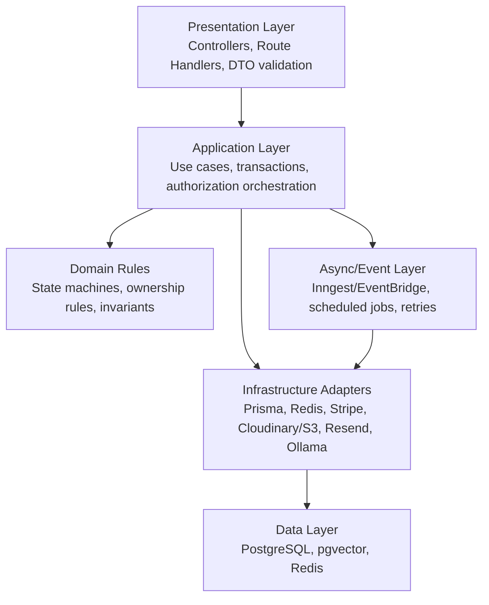
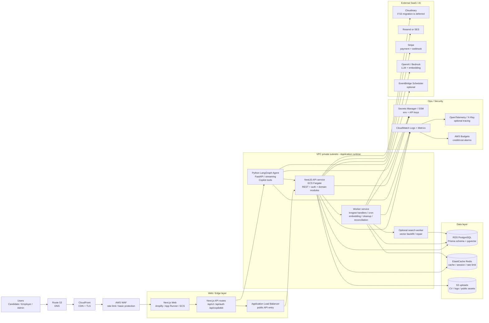
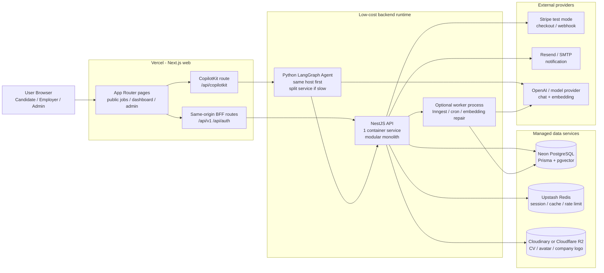
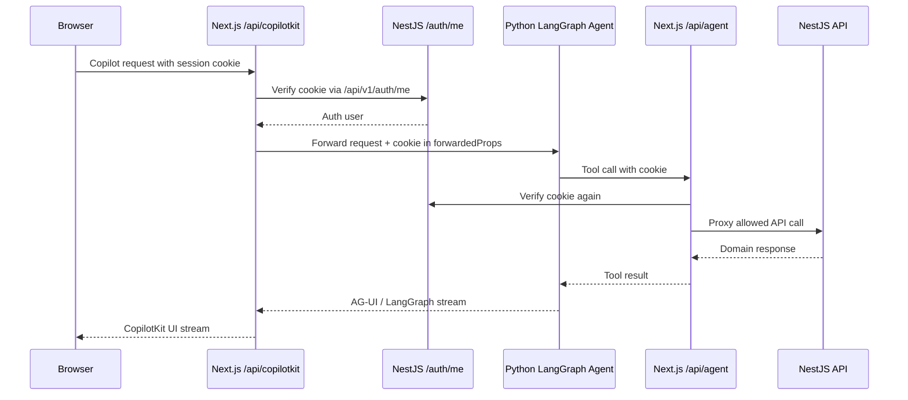

# Backend Architecture & AWS Production Review

> Scope: senior engineering review for the current Phu Quoc Jobs backend, frontend integration, database shape, and a small-production AWS architecture path.
>
> Updated: 2026-07-02
>
> Safety note: this document intentionally does not include `.env` secrets or raw connection strings. Database observations are aggregate/read-only snapshots from the local development database.

---

## 1. Executive Summary

The current system is a practical modular monolith: NestJS owns the API and business logic, Prisma/PostgreSQL owns transactional data, Redis supports cache/session behavior, Inngest owns asynchronous workflows, Next.js acts as both frontend and BFF, and the Python LangGraph agent is already separated behind CopilotKit.

This is a reasonable architecture for a small production launch. The right next move is not to split everything into microservices immediately. The right next move is to harden module boundaries, make production safety fixes, add observability, move infrastructure to managed AWS services, and keep extraction paths clear.

Recommended production direction:

- Start with **Small Prod on AWS**: CloudFront/WAF/ACM, Next.js web, NestJS API on ECS Fargate behind ALB, Python agent on ECS Fargate, RDS PostgreSQL with pgvector, ElastiCache Redis, S3/CloudFront or Cloudinary for uploads, Secrets Manager, CloudWatch/OpenTelemetry.
- Keep backend as a **modular monolith** for the first production phase.
- Treat AI agent, background/event workers, search/embedding jobs, and uploads as the first areas to isolate operationally.
- Prepare bounded contexts now so later service extraction does not require rewriting the domain model.

---

## 2. Current Architecture Review

### Current Logical Architecture

```mermaid
flowchart TB
    Browser[Browser]

    subgraph Web[Next.js Web / BFF]
        PublicSSR[Public SSR pages]
        DashboardCSR[Candidate / Employer dashboards]
        ApiV1[/api/v1/* proxy]
        ApiAuth[/api/auth/* proxy]
        CopilotRoute[/api/copilotkit runtime]
        AgentProxy[/api/agent/* tool proxy]
    end

    subgraph Backend[NestJS Backend]
        Guards[Throttler + AuthGuard + RolesGuard]
        Controllers[Controllers]
        Services[Application Services]
        Contracts[Shared read contracts]
        Events[Inngest event publisher]
        Cache[CacheService]
    end

    subgraph Data[Data & External Systems]
        Postgres[(PostgreSQL + pgvector)]
        Redis[(Redis)]
        Stripe[Stripe / Mock payment]
        Cloudinary[Cloudinary uploads]
        Resend[Resend email]
        Ollama[Ollama embeddings]
    end

    subgraph Agent[Python AI Agent]
        CopilotRuntime[CopilotKit Runtime connector]
        LangGraph[FastAPI + LangGraph agents]
        AgentTools[Candidate / Recruiter tools]
    end

    Browser --> PublicSSR
    Browser --> DashboardCSR
    DashboardCSR --> ApiV1
    DashboardCSR --> ApiAuth
    DashboardCSR --> CopilotRoute
    PublicSSR --> Backend
    ApiV1 --> Backend
    ApiAuth --> Backend
    CopilotRoute --> LangGraph
    LangGraph --> AgentProxy
    AgentProxy --> Backend

    Backend --> Guards
    Guards --> Controllers
    Controllers --> Services
    Services --> Contracts
    Services --> Events
    Services --> Cache
    Services --> Postgres
    Cache --> Redis
    Services --> Stripe
    Services --> Cloudinary
    Services --> Resend
    Services --> Ollama
```

### Backend Shape

Current backend stack:

- NestJS 11 API with global prefix `/api/v1`.
- better-auth under `/api/auth` plus custom auth under `/api/v1/auth`.
- Global response interceptor wraps successful responses as `{ data, timestamp }`.
- Global exception filter returns `{ statusCode, message, timestamp, path }`.
- Prisma with PostgreSQL and pgvector extension.
- Redis cache with cache-aside reads and `delPattern` invalidation.
- Inngest functions for notifications, job expiry, application cleanup, and weekly summaries.
- Stripe gateway with mock fallback.
- Cloudinary for company logos and uploaded candidate CV files.

This is a good early production baseline, but several production concerns should be fixed before launch.

### Frontend Integration Shape

Frontend integration is mostly correct:

- Public SSR pages call backend directly through `BACKEND_URL` for SEO-friendly data fetching.
- Authenticated client pages call same-origin BFF routes (`/api/v1`, `/api/auth`) with `credentials: "include"`.
- BFF forwards cookies and `Set-Cookie` headers, keeping browser/backend auth practical.
- CopilotKit is correctly placed server-side at `/api/copilotkit`, verifies the session through backend `/api/v1/auth/me`, then forwards cookie context into the agent request.
- Python agent tools call `/api/agent/*`, which verifies the cookie before proxying to backend APIs.

Main frontend/backend integration risk: response shapes are not fully consistent because some backend services return `{ data: ... }` themselves while the global interceptor also wraps responses. FE code already compensates in some places with `payload.data?.user || payload.user`, but the production API contract should be cleaned up.

### Database Snapshot

Aggregate read-only snapshot from the current local DB:

| Area | Observation |
|---|---:|
| Users | ~5.6k |
| Companies | ~180 |
| Jobs | ~5.2k |
| ACTIVE jobs | ~3.1k |
| ACTIVE jobs past deadline | ~1.7k |
| Applications | ~5.5k |
| Candidate resumes | ~5.5k |
| Blog posts | ~5k |
| Saved jobs / companies | ~5k each |
| Job embeddings | ~2.3k |
| Jobs missing embeddings | ~2.8k |
| ACTIVE jobs missing embeddings | ~800 |
| pgvector extension | enabled |

Important notes:

- `pg_stat_user_tables` approximate row stats were stale compared with real counts. Production needs autovacuum/analyze visibility.
- `job_embedding.embedding` currently has no visible ANN index. Vector search will degrade as rows grow.
- Many terminal applications exist; cleanup logic is present through Inngest, but production should verify retention execution and idempotency.
- Some ACTIVE jobs are past deadline; expiry scheduling should be audited against real payment/job activation history.

---

## 3. Senior Review Findings

Severity levels:

- **P0**: must fix before production.
- **P1**: should fix before meaningful traffic.
- **P2**: improve after small-prod launch.

| Severity | Area | Finding | Recommended Fix |
|---|---|---|---|
| P0 | Public jobs API | Public `GET /api/v1/jobs` accepts `status`, so public callers can request `DRAFT`, `PENDING`, or `CLOSED` jobs. | Public endpoint must force `ACTIVE` and non-expired jobs. Move owner/admin status queries to authenticated routes only. |
| P0 | Payment activation | Payment completion updates payment, activates job, sends event, and writes audit across multiple operations. | Wrap payment completion and job activation in a DB transaction. Add idempotency based on `gatewayRef`/event id. |
| P0 | Webhook/mock policy | Mock payment exists in the same production code path. | Disable mock gateway and `/mock-complete` unless `NODE_ENV !== production` or explicit feature flag is enabled. |
| P1 | Response contract | Some services return `{ data: ... }` and then global interceptor wraps again. | Services should return domain payloads only; interceptor owns the response envelope. Add API response typing. |
| P1 | Pagination | Query DTOs have `limit` minimum but no max. | Add max limits, for example public lists `limit <= 50`, admin exports behind separate endpoints. |
| P1 | DTO enums | Some DTOs use literal arrays in `@IsEnum`; query enum fields are plain strings. | Use Prisma enum values or explicit exported constants. Validate comma-separated filters safely. |
| P1 | Vector search | Embeddings are missing for many jobs; no visible ANN index. | Add backfill job, retry queue, freshness status, and pgvector HNSW/IVFFlat index after confirming RDS support/version. |
| P1 | Expired jobs | Many ACTIVE jobs are past deadline. | Add scheduled reconciliation job: close overdue ACTIVE jobs and emit/audit corrections. |
| P1 | Cache invalidation | `delPattern` scan by module prefix is acceptable now but can become expensive. | Move to key tagging/versioned cache prefixes for hot modules. Keep TTL short for public listings. |
| P1 | Authorization clarity | Middleware checks cookie only; backend owns role/ownership. This is correct but must be documented. | Keep backend as source of truth. FE layouts can redirect for UX only, never for security. |
| P1 | Agent auth | Agent gets cookie through CopilotKit forwarded props and `/api/agent` proxy. | Keep tool calls behind BFF. Do not let browser or agent call backend with raw secrets. Add audit metadata for AI-originated actions. |
| P2 | Shared contracts | Shared contracts are useful, but some write methods exist there (`activateJob`, `updateStatus`). | Separate read contracts from command/event workflows. Prefer events or explicit application services for cross-module writes. |
| P2 | Observability | Current logging exists but production tracing/metrics are not yet explicit. | Add OpenTelemetry traces, request ids, structured audit correlation, CloudWatch dashboards, and alert thresholds. |
| P2 | Upload storage | Cloudinary is fine early; AWS production may prefer S3/CloudFront for ownership/cost. | Choose one storage strategy before scale. If migrating to S3, keep storage adapter interface stable. |

---

## 4. Layer & Module Boundaries

### Required Layers



Layer rules:

- Controllers should only parse input, apply decorators, and call use cases/services.
- Application services should own transactions, authorization orchestration, and state transitions.
- Domain rules should be explicit and testable: job status machine, application status machine, payment activation policy, ownership policy.
- Infrastructure adapters should be replaceable: Stripe vs mock, Cloudinary vs S3, Ollama vs Bedrock/OpenAI embedding provider.
- Async handlers must be idempotent and safe to retry.

### Bounded Contexts for the Current Backend

Keep the code as a modular monolith, but organize thinking and future work around these contexts:

| Context | Owns | Current Modules |
|---|---|---|
| Identity & Access | better-auth, sessions, role selection, guards, users | `auth`, `users` |
| Marketplace Catalog | public jobs, companies, categories, address, search/filter | `jobs`, `companies`, `categories`, `address` |
| Employer Workspace | company profile, job creation, checkout flow, applicant review | `companies`, `jobs`, `applications`, `payments` |
| Candidate Workspace | resumes, saved jobs/companies, applications | `resumes`, `saved`, `applications` |
| Application Pipeline | apply, status transitions, CV viewing rules, cleanup retention | `applications`, `upload`, `notifications` |
| Billing & Posting | pricing, payment, job activation, invoices later | `pricing`, `payments`, `jobs` |
| Notification & Audit | notifications, audit logs, event side effects | `notifications`, `audit`, `inngest` |
| Content & SEO | blogs, blog categories, sitemap/public pages | `blogs`, `blog-categories` |
| AI Agent | CopilotKit runtime, LangGraph, agent tools, semantic search | `web/agent`, `/api/copilotkit`, `/api/agent`, `jobs/search-vector` |

### Cross-Module Communication Rules

Use these rules for future backend tasks:

1. Same module: controller -> service -> Prisma is acceptable.
2. Cross-module read: use typed contract/query service.
3. Cross-module side effect: publish event; handler owns the target write.
4. Cross-module transaction: keep inside one application service only when strong consistency is required, for example payment completion activating a job.
5. Do not import another module's internal service just to reuse logic.
6. Do not put business writes into generic shared contracts unless the contract is explicitly a command boundary with idempotency and tests.

---

## 5. AWS Small Production Architecture

### Recommended Small-Prod Target



### Recommended AWS Components

| Concern | Small-prod recommendation | Notes |
|---|---|---|
| DNS/TLS | Route 53 + ACM | Centralized domain and certificates. |
| Edge/security | CloudFront + AWS WAF | Cache public assets, rate-limit obvious abuse, protect auth/API paths. |
| Frontend | Amplify Hosting or App Runner/ECS | Amplify is easiest for Next.js; ECS gives consistent container ops with API/agent. |
| API | ECS Fargate + ALB | Good fit for NestJS long-running API and cookie auth. |
| Agent | ECS Fargate private service | Keeps LangGraph/FastAPI separate and independently scalable. |
| Database | RDS PostgreSQL | Validate pgvector extension/version in target engine before migration. |
| Cache/session | ElastiCache Redis | Shared cache/session store for horizontal API replicas. |
| Files | Keep Cloudinary short term, or migrate to S3 + CloudFront | S3 gives AWS-native ownership and cost control; migration needs storage adapter. |
| Secrets | AWS Secrets Manager / SSM Parameter Store | No env secrets in repo or task definitions. |
| Async | Inngest Cloud first, or self-host workers on ECS | EventBridge Scheduler can cover simple cron/reconciliation jobs. |
| Observability | CloudWatch + structured logs + OpenTelemetry | Add request id, user id, module, action, and event id. |
| AI models | OpenAI initially; evaluate Bedrock later | Bedrock is useful for AWS-native governance, but not required for launch. |

### Demo / Academic Budget Adjustment

If the near-term target is an academic demo with roughly 100 USD of AWS credits over 6 months, do not deploy the full AWS production stack immediately. The architecture above is useful as a target system design, but RDS, ElastiCache, ALB, NAT Gateway, and multiple always-on ECS services can consume credits quickly if they are left running.

Important points from current AWS documentation:

- A new AWS Free Tier account can receive credits for a limited period, but the Free plan only includes selected services.
- AWS credits are automatically applied to eligible services until they are exhausted or expire.
- Paid-only services or configurations beyond free limits can still burn credits quickly, so AWS Budget alerts should be configured on day one.
- AWS Educate is good for learning and hands-on labs, but it should not be treated as a guarantee that every production service is free for the project.

Separate two concerns:

1. **Architecture for the report:** the AWS-native small production target above.
2. **Architecture for the actual demo:** a low-cost hybrid deployment that uses AWS only where it is useful for learning or presentation.

### Recommended Demo Architecture



Practical demo recommendation:

| Component | Demo choice | Reason |
|---|---|---|
| Frontend | Vercel | Best fit for Next.js App Router, SSR, BFF routes, and the CopilotKit route. |
| Backend | One NestJS container | Enough for demo/small production; can run on AWS App Runner/ECS if AWS credits are part of the report. |
| Agent | Same host first, or one small separate service | Split only when streaming/long-running agent workflows start affecting API latency. |
| Database | Neon PostgreSQL | Better fit for Prisma/Postgres/pgvector than Cloudflare D1; has a free tier and branching. |
| Redis | Upstash Redis | Lighter and cheaper than ElastiCache for a demo; enough for small session/cache usage. |
| Uploads | Keep Cloudinary or use Cloudflare R2 | R2 has a free allowance and no R2 egress charge model; S3 is better if AWS-native storage is required. |
| AWS | Use selectively | Use App Runner/ECS, S3, or CloudWatch to demonstrate cloud architecture; avoid enabling every managed service 24/7. |

### Quick Cloud Option Comparison

| Platform | Good For | Strengths | Limits / Risks | Recommendation |
|---|---|---|---|---|
| AWS Free Tier/Credits | Cloud report, containers, storage, observability | Full production ecosystem and strong architecture story | Free plan is limited to selected services; credits expire or run out; RDS/ElastiCache/ALB can be costly if always on | Use as target architecture and deploy selectively. |
| Vercel Hobby | Next.js frontend, light SSR, API route BFF | Excellent Next.js DX, fast deployment, preview environments | Hobby is intended for personal/non-commercial use; functions have time/resource limits; not ideal for a long-running NestJS monolith | Use for FE/BFF routes. |
| Cloudflare Pages/Workers | Static/edge apps, edge middleware, CDN | Strong CDN and generous edge/static limits | Workers have CPU/memory limits; D1 is not PostgreSQL; not a direct replacement for Prisma/Postgres/pgvector | Use DNS/CDN/R2; do not move the NestJS backend to Workers at this stage. |
| Neon PostgreSQL | Serverless Postgres for demo/dev | Works with Prisma, supports branching, scale-to-zero, and extensions such as `pg_vector` | Free tier has storage/compute limits; scale-to-zero can cause cold starts; production guarantees need a paid plan | Best demo DB option if avoiding 24/7 RDS cost. |
| Upstash Redis | Lightweight Redis cache/session | Free tier is enough for a small demo, pay-as-you-go is easy to cap | Command/storage limits; region latency needs checking | Use instead of ElastiCache for the demo. |
| Cloudflare R2 | CV/logo/public asset storage | Free allowance and no R2 egress charge model | Needs storage adapter/S3-compatible config; does not replace Cloudinary transformations if those are used heavily | Consider if moving uploads away from Cloudinary. |

### Why Not Microservices Immediately?

The current project has one relational domain with strong joins between users, companies, jobs, applications, payments, resumes, notifications, and audit. Splitting too early would create distributed transactions around the most important flows:

- Employer creates job -> checkout -> payment completed -> job active.
- Candidate applies -> employer receives notification -> application status changes -> candidate notification/cleanup.
- Employer views candidate CV through application ownership.

For small production, a modular monolith keeps these flows reliable and easier to debug. Scale by isolating runtime workloads first: API replicas, agent service, workers, Redis, RDS, and CDN.

### Is One Backend Enough?

Yes. One backend is the right starting point for this project. The data volume is still in the thousands of records, the domain is still evolving, the team is small, and the first production requirement is correctness: authorization, payment idempotency, clear response contracts, observability, and stable deployment.

The better approach is not to split into many backend services now. Split in two layers instead:

1. **One backend codebase as a modular monolith:** keep NestJS modules aligned with bounded contexts.
2. **Multiple runtimes when needed:** deploy `api-service`, `worker-service`, and `agent-service` separately when their workload profiles diverge.

One backend becomes a problem when AI workflows or embedding jobs block request/response traffic, when payment/webhook logic needs stronger idempotent isolation, when background work inflates API CPU/memory, or when public API replicas need to scale independently from workers.

For this project:

- First demo: one NestJS API container is enough.
- Next stability step: split the Python agent runtime if it is slow or streaming-heavy.
- Next operational step: split worker/Inngest handlers from the API.
- Later business scale: extract billing, search, notification, or the AI agent platform only after metrics justify it.

---

## 6. Service Extraction Roadmap

### Phase 1: Small Production Hardening

Keep the backend monolith, but fix production blockers:

- Force public jobs to `ACTIVE` and non-expired regardless of query params.
- Add max pagination limits and consistent DTO enum validation.
- Normalize response payloads so global interceptor is the only response envelope.
- Wrap payment completion + job activation + audit in transaction with idempotency.
- Disable mock payment in production.
- Add overdue ACTIVE job reconciliation.
- Add embedding backfill job and vector ANN index plan.
- Add request correlation id, structured logs, and CloudWatch dashboards.

### Phase 2: Operational Split

Split by runtime pressure, not by domain fashion:

- API service: NestJS request/response workload.
- Worker service: Inngest functions, reconciliation, embedding sync, email retries.
- Agent service: Python LangGraph/FastAPI, independently scaled and rate-limited.
- Optional search worker: embedding generation/backfill and vector index maintenance.

Code can remain in the monorepo. Deployment units become separate containers.

### Phase 3: Domain Extraction Only When Needed

Extract only after measurable load or team ownership justifies it:

| Candidate Service | Extract When | Boundary |
|---|---|---|
| Search/Recommendation | Vector search/backfill becomes heavy or model-specific | Read optimized job index, embedding store, search API. |
| Notification | High volume notifications, multiple channels, retry complexity | Consumes events, owns notification delivery state. |
| Billing/Payment | Finance reporting, invoices, refunds, compliance complexity | Owns payments, pricing, invoice ledger; emits posting activation event. |
| Content/SEO | Blog/editorial workflow grows independently | Owns blogs, landing pages, sitemap feeds. |
| AI Agent Platform | Agent workflows become product-critical | Owns agent runtime, memory, tool gateway, observability. |

Do not extract `Applications` early; it sits at the center of candidate, employer, job, resume, and notification flows.

---

## 7. CopilotKit & AWS AgentCore Notes

### Current Copilot Path



This is a good security shape: the browser does not call the Python agent tools directly with backend secrets, and the agent does not bypass backend authorization.

### AWS AgentCore Option

CopilotKit documents this AgentCore pattern:

```text
Browser -> CopilotKit Runtime -> AgentCore Runtime -> your agent
```

That maps cleanly to this project:

- Browser: existing Next.js app with `CopilotKitProvider`.
- CopilotKit Runtime: existing `/api/copilotkit` route, or a standalone runtime service later.
- AgentCore Runtime: future AWS-hosted agent runtime.
- Agent: current Python LangGraph agent adapted to AgentCore/AG-UI deployment.

Use AgentCore later if the AI agent becomes a core production workload requiring stronger session isolation, managed memory, agent observability, or AWS-native governance. For small production, ECS Fargate for the Python agent is simpler and cheaper to reason about.

### Agent Production Rules

- Agent tools must call backend through authenticated BFF/API paths only.
- AI-originated writes should include audit metadata, for example `source: "ai-agent"`, `agentName`, and user id.
- Agent actions that create jobs, update application status, or save resumes should be human-confirmed in the UI for early production.
- Long-running agent workflows should be async/resumable, not tied to a single browser request.
- Add rate limits and model-cost budgets per user/role.

---

## 8. Database & Search Recommendations

### Transactional Database

RDS PostgreSQL is the right small-prod target. Before migration:

- Confirm target RDS PostgreSQL version supports the required pgvector extension version.
- Add migration/test checklist for `CREATE EXTENSION vector`.
- Enable automated backups, point-in-time recovery, deletion protection, and Multi-AZ if budget allows.
- Monitor slow queries, connection count, CPU, memory, storage, locks, autovacuum, and dead tuples.
- Add Prisma connection pool policy appropriate for ECS task count.

### Indexing

Current indexes cover many foreign keys and unique constraints. Add or review:

- Composite indexes for hot public job filters: `(status, deadline)`, `(status, categoryId)`, `(status, wardId)`, and possibly `(companyId, status)`.
- Application employer views: index paths supporting `job.company.ownerId` joins, or query through jobs owned by employer first if needed.
- Notification unread count: consider `(userId, isRead, createdAt)`.
- Blog public lists: `(isPublished, createdAt)` and category filters if traffic grows.
- Vector search: HNSW or IVFFlat index on `job_embedding.embedding` after confirming pgvector/RDS support and choosing operator class.

### Embedding Workflow

Current embedding sync is best-effort after job create/update. Production should add:

- A durable embedding job queue/table or event handler.
- Backfill command for jobs missing embeddings.
- Retry and error state for failed embeddings.
- Re-embed when title/description/benefits change.
- Metrics: total jobs, jobs with embeddings, active jobs without embeddings, embedding failure rate.

---

## 9. FE/BE Contract Recommendations

### Keep FE BFF Pattern

The current BFF pattern is correct for cookie auth:

- Browser talks same-origin to Next routes.
- Next forwards cookies to backend.
- Backend remains source of truth for auth, role, and ownership.

### Clean API Contract

Before production, standardize backend responses:

```json
{
  "data": {},
  "timestamp": "2026-07-02T00:00:00.000Z"
}
```

Service methods should not return an extra `{ data: ... }` wrapper. This avoids frontend branches like `payload.data?.user || payload.user` and makes generated clients easier later.

### Recommended Frontend Access Rules

- Public SSR pages may call backend directly using server-only `BACKEND_URL`.
- Client components should call same-origin BFF routes.
- Authenticated FE pages can redirect for UX, but backend guards must enforce all security.
- Do not expose backend internal URL or secrets through `NEXT_PUBLIC_*` except explicit public config.

---

## 10. Production Readiness Checklist

### Must Fix Before Launch

- [ ] Public jobs endpoint cannot expose non-ACTIVE jobs.
- [ ] Production disables mock payment completion.
- [ ] Payment webhook completion is transactional and idempotent.
- [ ] Response shape is consistent.
- [ ] Pagination limits are capped.
- [ ] Secrets are moved to AWS Secrets Manager/SSM.
- [ ] RDS pgvector compatibility is verified.
- [ ] CloudWatch logs and basic alarms are configured.
- [ ] Backups and restore drill are documented.

### Should Fix Before Growth

- [ ] Embedding backfill and retry flow exists.
- [ ] Vector ANN index exists for semantic search.
- [ ] Expired ACTIVE jobs reconciliation exists.
- [ ] Inngest/event handlers are idempotent.
- [ ] Request id and audit correlation id exist.
- [ ] Cache invalidation strategy is documented per module.
- [ ] Load test public job search and employer dashboard queries.

### Can Improve Later

- [ ] Move uploads from Cloudinary to S3 if AWS-native ownership/cost is preferred.
- [ ] Split workers from API deployment.
- [ ] Evaluate Bedrock/AgentCore for AI agent runtime.
- [ ] Add OpenAPI-generated frontend client after response contract stabilizes.
- [ ] Extract notification/search/billing services only after measurable pressure.

---

## 11. Source References

### CopilotKit / Agent

- CopilotKit AWS AgentCore docs: https://docs.copilotkit.ai/deploy/agentcore
- CopilotKit deploy-to-any-runtime docs: https://docs.copilotkit.ai/runtime-server-adapter
- CopilotKit AG-UI agents docs: https://docs.copilotkit.ai/backend/ag-ui
- Amazon Bedrock AgentCore overview: https://docs.aws.amazon.com/bedrock-agentcore/latest/devguide/what-is-bedrock-agentcore.html
- Amazon Bedrock AgentCore Runtime: https://docs.aws.amazon.com/bedrock-agentcore/latest/devguide/agents-tools-runtime.html

### AWS

- AWS compute services overview, including ECS/Fargate/App Runner/Lambda: https://docs.aws.amazon.com/whitepapers/latest/aws-overview/compute-services.html
- Amazon RDS PostgreSQL extensions: https://docs.aws.amazon.com/AmazonRDS/latest/UserGuide/Appendix.PostgreSQL.CommonDBATasks.Extensions.html
- AWS Free Tier: https://aws.amazon.com/free/
- AWS credits billing: https://docs.aws.amazon.com/awsaccountbilling/latest/aboutv2/useconsolidatedbilling-credits.html
- AWS Educate: https://aws.amazon.com/education/awseducate/

### Vercel / Cloudflare / Neon / Redis

- Vercel Hobby plan: https://vercel.com/docs/plans/hobby
- Vercel Functions limitations: https://vercel.com/docs/functions/limitations
- Cloudflare Pages limits: https://developers.cloudflare.com/pages/platform/limits/
- Cloudflare Workers limits: https://developers.cloudflare.com/workers/platform/limits/
- Cloudflare D1 limits: https://developers.cloudflare.com/d1/platform/limits/
- Cloudflare R2 pricing: https://developers.cloudflare.com/r2/pricing/
- Neon pricing: https://neon.com/pricing
- Neon branching: https://neon.com/docs/introduction/branching
- Upstash Redis pricing: https://upstash.com/pricing/redis

---

## 12. Final Recommendation

For the next backend tasks, optimize for production correctness before service extraction:

1. Fix public visibility, payment idempotency, response contracts, and pagination.
2. For the academic demo, prefer a low-cost hybrid deployment: Vercel for FE/BFF, one NestJS backend container, Neon Postgres, Upstash Redis, and Cloudinary or Cloudflare R2.
3. For the system design report, keep the AWS target architecture: CloudFront/WAF, ECS/App Runner, RDS, ElastiCache, S3, CloudWatch, and Secrets Manager.
4. Split runtime units into API, worker, and agent only when needed; do not split domain services early.
5. Add observability and DB/search maintenance.
6. Extract services only when operational metrics prove the need.

This path keeps the demo affordable, preserves a credible AWS production architecture for the report, and creates clean boundaries for later scale.
