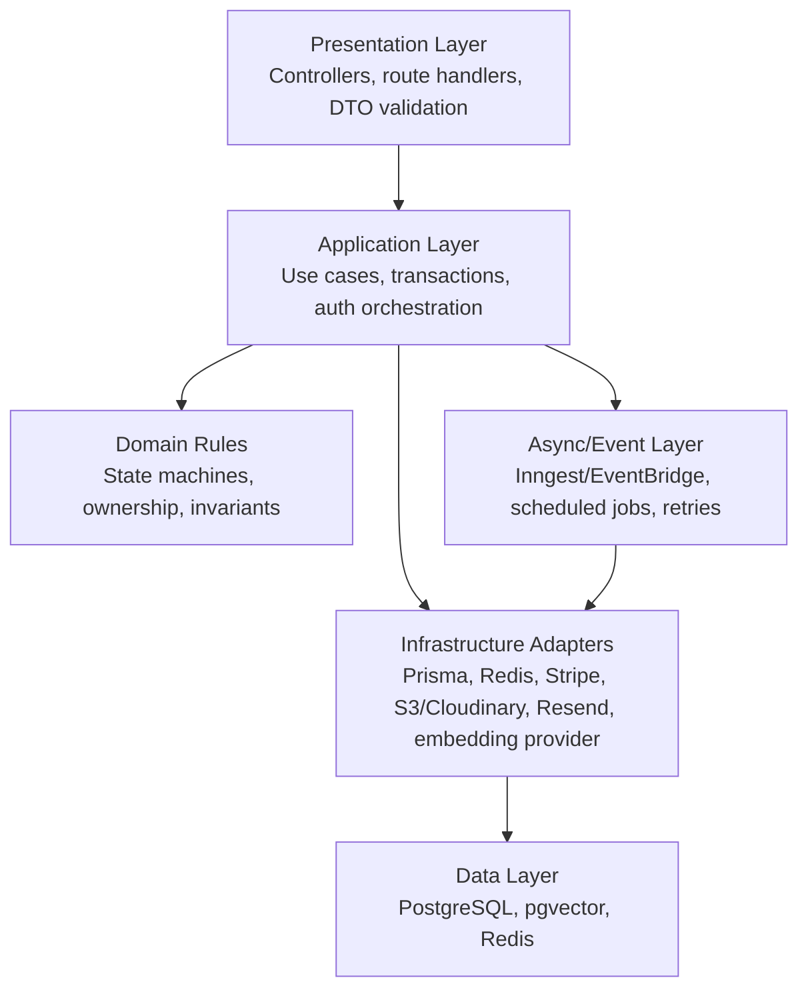
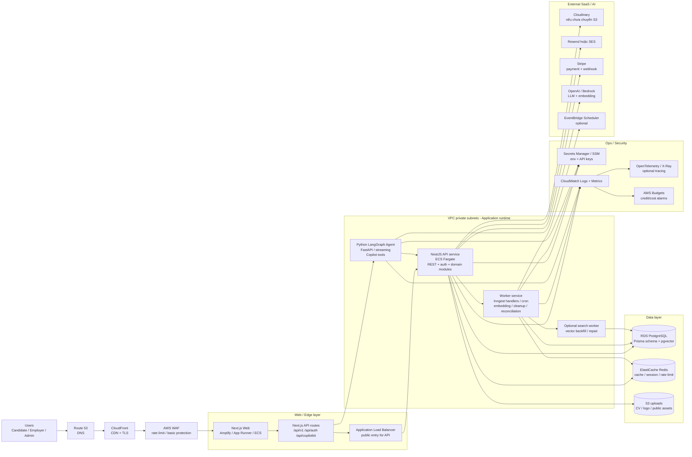
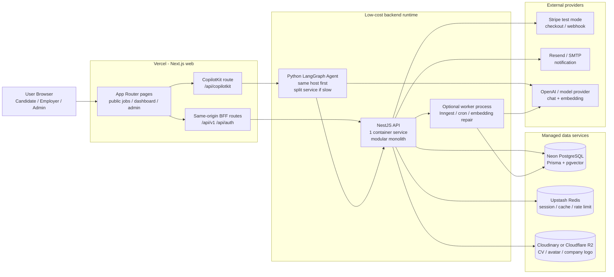
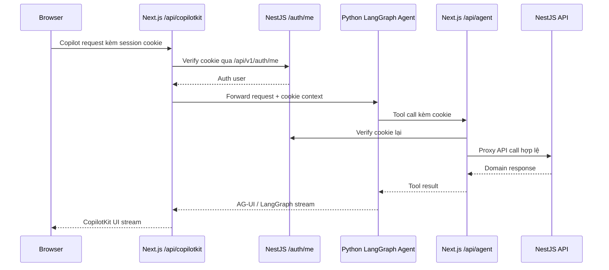

# Đánh giá kiến trúc Backend & hướng triển khai AWS Production

> Phạm vi: đánh giá backend Phú Quốc Jobs ở góc nhìn senior software engineer, bao gồm logic BE, cách FE tương tác, thiết kế DB hiện tại, hướng scale module, và kiến trúc AWS production giai đoạn nhỏ.
>
> Cập nhật: 2026-07-03
>
> Lưu ý bảo mật: tài liệu này không ghi `.env`, secret, hay connection string. Các số liệu DB chỉ là thống kê tổng hợp đọc-only từ database local.

---

## 1. Tóm tắt điều hành

Project hiện tại đang đi theo hướng **modular monolith** khá hợp lý cho giai đoạn production nhỏ:

- Backend NestJS giữ API, auth, business logic và module boundary.
- Prisma/PostgreSQL giữ dữ liệu giao dịch chính.
- PostgreSQL đã bật pgvector cho semantic search.
- Redis dùng cho cache/session.
- Inngest xử lý async workflow như notification, job expiry, cleanup application.
- Next.js vừa là frontend vừa là BFF proxy cho browser.
- Python LangGraph agent đã tách riêng và kết nối qua CopilotKit.

Kết luận chính: **chưa nên tách microservice ngay**. Việc cần làm trước production là harden logic, chuẩn hóa contract FE/BE, fix các rủi ro public API/payment/search, thêm observability, và deploy lên AWS theo hướng nhỏ trước nhưng có đường tách module rõ ràng.

Khuyến nghị production giai đoạn đầu:

- CloudFront + WAF + ACM ở edge.
- Next.js deploy bằng AWS Amplify, App Runner, hoặc ECS.
- NestJS API chạy ECS Fargate sau ALB.
- Python agent chạy ECS Fargate riêng.
- RDS PostgreSQL có pgvector.
- ElastiCache Redis.
- S3/CloudFront hoặc tiếp tục Cloudinary cho upload.
- Secrets Manager/SSM cho secret.
- CloudWatch/OpenTelemetry cho logs, metrics, traces.

---

## 2. Kiến trúc hiện tại

### Sơ đồ tổng quan hiện tại

```mermaid
flowchart TB
    Browser[Browser]

    subgraph Web[Next.js Web / BFF]
        PublicSSR[Trang public SSR]
        DashboardCSR[Dashboard Candidate / Employer]
        ApiV1[/api/v1/* proxy]
        ApiAuth[/api/auth/* proxy]
        CopilotRoute[/api/copilotkit runtime]
        AgentProxy[/api/agent/* tool proxy]
    end

    subgraph Backend[NestJS Backend]
        Guards[Throttler + AuthGuard + RolesGuard]
        Controllers[Controllers]
        Services[Application Services]
        Contracts[Shared read contracts]
        Events[Inngest event publisher]
        Cache[CacheService]
    end

    subgraph Data[Dữ liệu & hệ thống ngoài]
        Postgres[(PostgreSQL + pgvector)]
        Redis[(Redis)]
        Stripe[Stripe / Mock payment]
        Cloudinary[Cloudinary uploads]
        Resend[Resend email]
        Ollama[Ollama embeddings]
    end

    subgraph Agent[Python AI Agent]
        LangGraph[FastAPI + LangGraph agents]
        AgentTools[Candidate / Recruiter tools]
    end

    Browser --> PublicSSR
    Browser --> DashboardCSR
    DashboardCSR --> ApiV1
    DashboardCSR --> ApiAuth
    DashboardCSR --> CopilotRoute
    PublicSSR --> Backend
    ApiV1 --> Backend
    ApiAuth --> Backend
    CopilotRoute --> LangGraph
    LangGraph --> AgentProxy
    AgentProxy --> Backend

    Backend --> Guards
    Guards --> Controllers
    Controllers --> Services
    Services --> Contracts
    Services --> Events
    Services --> Cache
    Services --> Postgres
    Cache --> Redis
    Services --> Stripe
    Services --> Cloudinary
    Services --> Resend
    Services --> Ollama
```

### Nhận xét backend

Backend hiện tại có nền tốt:

- NestJS 11, global prefix `/api/v1`.
- better-auth chạy ở `/api/auth`.
- Custom auth profile/role chạy ở `/api/v1/auth`.
- Global interceptor bọc response dạng `{ data, timestamp }`.
- Global exception filter trả lỗi dạng `{ statusCode, message, timestamp, path }`.
- Prisma schema có quan hệ rõ giữa user, company, job, application, resume, payment, notification.
- Có Shared contracts để query cross-module.
- Có Inngest để xử lý side effect bất đồng bộ.

Điểm cần cải thiện trước production:

- Một số logic production-critical chưa đủ transactional/idempotent.
- Một số response bị nguy cơ double-wrap `{ data: { data: ... } }`.
- Public endpoint jobs đang nhận query `status`, có thể leak job không public.
- Cache invalidation bằng pattern scan còn ổn ở giai đoạn nhỏ nhưng sẽ cần chiến lược tốt hơn khi traffic tăng.
- Vector search thiếu backfill đầy đủ và chưa thấy ANN index cho embedding.

### Nhận xét frontend tương tác với backend

Cách FE đang tương tác là hợp lý:

- Trang public SSR gọi backend trực tiếp bằng `BACKEND_URL`.
- Client/dashboard gọi same-origin BFF routes `/api/v1/*`, `/api/auth/*`.
- BFF forward cookie và `Set-Cookie`, phù hợp với cookie-based auth.
- `/api/copilotkit` kiểm tra session qua backend trước khi gọi Python agent.
- `/api/agent/*` kiểm tra cookie trước khi agent tool gọi backend.

Nguyên tắc nên giữ:

- FE redirect chỉ để UX.
- Backend guard/service mới là nguồn sự thật về auth, role, ownership.
- Browser không nên gọi trực tiếp Python agent tool hoặc backend internal service bằng secret.

---

## 3. Snapshot DB hiện tại

Thống kê tổng hợp từ DB local:

| Khu vực | Số liệu xấp xỉ |
|---|---:|
| Users | ~5.6k |
| Companies | ~180 |
| Jobs | ~5.2k |
| ACTIVE jobs | ~3.1k |
| ACTIVE jobs đã quá deadline | ~1.7k |
| Applications | ~5.5k |
| Candidate resumes | ~5.5k |
| Blog posts | ~5k |
| Saved jobs / companies | ~5k mỗi loại |
| Job embeddings | ~2.3k |
| Jobs thiếu embedding | ~2.8k |
| ACTIVE jobs thiếu embedding | ~800 |
| pgvector | đã bật |

Nhận xét DB:

- Dữ liệu dev/local đã đủ lớn để bắt đầu thấy vấn đề query/index/cache.
- `pg_stat_user_tables` có dấu hiệu stale stats, cần theo dõi autovacuum/analyze khi production.
- `JobEmbedding` chưa cover toàn bộ jobs, semantic search sẽ thiếu kết quả.
- Có nhiều `ACTIVE` jobs đã quá hạn, cần reconciliation job để đóng job quá deadline.
- Nên bổ sung index cho các query public hot path và vector search.

---

## 4. Findings cần xử lý

| Mức độ | Khu vực | Vấn đề | Khuyến nghị |
|---|---|---|---|
| P0 | Public jobs API | `GET /api/v1/jobs` nhận `status`, public user có thể query job `DRAFT/PENDING/CLOSED`. | Public endpoint luôn force `ACTIVE` và chưa quá hạn. Query status chỉ cho route owner/admin. |
| P0 | Payment | Complete payment, update job, send event, audit là nhiều thao tác rời. | Gói trong transaction, thêm idempotency theo `gatewayRef` hoặc event id. |
| P0 | Mock payment | Mock gateway/mock-complete tồn tại cùng code path production. | Chặn mock khi `NODE_ENV=production`, hoặc dùng feature flag rõ ràng. |
| P1 | Response contract | Một số service tự trả `{ data }`, interceptor lại bọc tiếp. | Service trả payload domain thuần, interceptor là nơi duy nhất bọc response. |
| P1 | Pagination | DTO có min nhưng chưa có max limit. | Thêm max limit, ví dụ public list tối đa 50. |
| P1 | DTO enum/filter | Một số enum validation còn lỏng, query filter là string comma-separated. | Dùng enum từ Prisma hoặc const typed rõ ràng, parse/validate filter tập trung. |
| P1 | Vector search | Thiếu embedding cho nhiều jobs, chưa có ANN index. | Thêm backfill job, retry, trạng thái embedding, HNSW/IVFFlat index sau khi xác nhận RDS hỗ trợ. |
| P1 | Expired jobs | Nhiều ACTIVE job đã quá deadline. | Thêm scheduled reconciliation để đóng job quá hạn và audit lại. |
| P1 | Cache | `delPattern` bằng scan có thể tốn khi key lớn. | Giai đoạn nhỏ vẫn dùng được; sau đó chuyển sang cache version/tag key. |
| P1 | Agent write | Agent có thể tạo/sửa dữ liệu qua tool. | Thêm audit metadata `source=ai-agent`, human confirmation cho hành động quan trọng. |
| P2 | Shared contracts | Shared contracts hiện có cả write method như activate job. | Tách read contract và command boundary; cross-module write nên qua event/use case rõ. |
| P2 | Observability | Chưa thấy tracing/metrics production rõ. | Thêm request id, structured logs, CloudWatch dashboard, OpenTelemetry. |

---

## 5. Layer chuẩn nên hướng tới



Quy tắc layer:

- Controller không chứa business logic.
- Service/use case quản lý transaction, authorization orchestration, state transition.
- Domain rule phải explicit và test được: job status, application status, payment activation.
- Adapter hạ tầng phải thay được: Stripe/mock, Cloudinary/S3, Ollama/OpenAI/Bedrock.
- Event handler phải idempotent vì production async luôn có retry.

---

## 6. Bounded Context nên dùng cho backend

Vẫn giữ modular monolith, nhưng chia tư duy module như sau:

| Context | Trách nhiệm | Module hiện tại |
|---|---|---|
| Identity & Access | Auth, session, role, user admin | `auth`, `users` |
| Marketplace Catalog | Jobs public, companies, categories, address, search | `jobs`, `companies`, `categories`, `address` |
| Employer Workspace | Company profile, job create, checkout, review candidate | `companies`, `jobs`, `applications`, `payments` |
| Candidate Workspace | Resume, saved jobs/companies, apply jobs | `resumes`, `saved`, `applications` |
| Application Pipeline | Apply, status transition, CV access, cleanup | `applications`, `upload`, `notifications` |
| Billing & Posting | Pricing, payment, job activation | `pricing`, `payments`, `jobs` |
| Notification & Audit | Notification, audit, async side effects | `notifications`, `audit`, `inngest` |
| Content & SEO | Blog, blog category, sitemap content | `blogs`, `blog-categories` |
| AI Agent | CopilotKit, LangGraph, tool proxy, semantic search | `web/agent`, `/api/copilotkit`, `/api/agent`, `jobs/search-vector` |

Quy tắc cross-module:

1. Trong cùng module: controller -> service -> Prisma là ổn.
2. Cross-module read: dùng typed contract/query service.
3. Cross-module side effect: bắn event.
4. Cross-module write cần strong consistency: gom trong một application use case rõ ràng.
5. Không import service nội bộ của module khác chỉ để tái sử dụng logic.

---

## 7. Kiến trúc AWS production nhỏ

### Sơ đồ AWS đề xuất



### Thành phần AWS đề xuất

| Concern | Đề xuất nhỏ trước | Ghi chú |
|---|---|---|
| DNS/TLS | Route 53 + ACM | Quản lý domain/certificate tập trung. |
| Edge | CloudFront + WAF | Cache static/public, rate limit, bảo vệ route auth/API. |
| Frontend | Amplify Hosting hoặc App Runner/ECS | Amplify dễ nhất cho Next.js; ECS đồng nhất container với BE/agent. |
| Backend API | ECS Fargate + ALB | Phù hợp NestJS API chạy lâu dài, scale ngang. |
| Python Agent | ECS Fargate service riêng | Scale độc lập, tránh ảnh hưởng API chính. |
| Database | RDS PostgreSQL | Cần xác nhận pgvector extension/version trước migration. |
| Cache/session | ElastiCache Redis | Dùng chung cho nhiều API replicas. |
| Upload | Giữ Cloudinary hoặc chuyển S3 + CloudFront | S3 tốt nếu muốn AWS-native/cost ownership. |
| Secret | Secrets Manager / SSM | Không để secret trong task definition plaintext. |
| Async | Inngest Cloud hoặc worker ECS | EventBridge Scheduler dùng cho cron/reconciliation đơn giản. |
| Observability | CloudWatch + OpenTelemetry | Log có request id/user id/module/action/event id. |
| AI model | OpenAI trước, cân nhắc Bedrock sau | Bedrock có lợi về governance AWS-native, không bắt buộc cho launch. |

### Điều chỉnh cho demo đồ án / ngân sách nhỏ

Nếu mục tiêu trước mắt là demo đồ án với ngân sách khoảng 100 USD trong 6 tháng, không nên triển khai ngay toàn bộ stack AWS production ở trên. Kiến trúc AWS đầy đủ có giá trị để trình bày system design, nhưng RDS, ElastiCache, ALB, NAT Gateway, ECS service chạy 24/7 có thể đốt credit nhanh nếu cấu hình không chặt.

Điểm quan trọng từ tài liệu AWS hiện tại:

- AWS Free Tier account mới có thể nhận credit ban đầu và dùng trong thời hạn giới hạn, nhưng Free plan chỉ mở một số dịch vụ chọn lọc.
- Credit được AWS tự áp dụng cho dịch vụ đủ điều kiện cho tới khi hết hoặc hết hạn.
- Một số dịch vụ paid-only hoặc cấu hình vượt free tier vẫn có thể ăn credit rất nhanh, nên cần đặt AWS Budget alert từ ngày đầu.
- AWS Educate phù hợp để học/làm lab, nhưng không nên giả định mọi service production đều miễn phí cho đồ án.

Vì vậy nên tách 2 khái niệm:

1. **Kiến trúc mục tiêu để báo cáo:** AWS-native small production như sơ đồ ở trên.
2. **Kiến trúc chạy demo thật:** hybrid chi phí thấp, chỉ dùng AWS ở phần cần minh họa hoặc phần có credit an toàn.

### Kiến trúc demo khuyến nghị



Đề xuất thực tế cho đồ án:

| Thành phần | Chọn cho demo | Lý do |
|---|---|---|
| Frontend | Vercel | Next.js App Router, SSR, API route/BFF và CopilotKit route hợp nhất hơn Cloudflare Pages. |
| Backend | 1 NestJS container | Đủ cho demo/small prod; có thể chạy trên AWS App Runner/ECS nếu muốn dùng AWS credit. |
| Agent | Ban đầu chạy chung host hoặc service nhỏ riêng | Nếu agent stream/chạy lâu, tách runtime riêng để không làm nghẽn API. |
| Database | Neon PostgreSQL | Hợp Prisma/Postgres/pgvector hơn Cloudflare D1; có free tier cho demo, có branching. |
| Redis | Upstash Redis | Nhẹ hơn ElastiCache cho demo, có free tier, phù hợp session/cache nhỏ. |
| Upload | Giữ Cloudinary hoặc dùng Cloudflare R2 | R2 có free allowance và không tính egress theo mô hình R2; S3 dùng khi muốn AWS-native. |
| AWS | Dùng chọn lọc | App Runner/ECS cho BE hoặc S3/CloudWatch để minh họa cloud architecture; tránh bật nhiều managed service 24/7. |

### So sánh nhanh AWS, Cloudflare, Vercel, Neon

| Nền tảng | Hợp với | Điểm mạnh | Giới hạn/rủi ro | Khuyến nghị cho project này |
|---|---|---|---|---|
| AWS Free Tier/Credit | Báo cáo cloud, deploy container, storage, observability | Hệ sinh thái production đầy đủ, dễ trình bày kiến trúc chuẩn | Free plan giới hạn dịch vụ; credit hết/hết hạn thì phát sinh rủi ro chi phí; RDS/ElastiCache/ALB chạy 24/7 không rẻ | Dùng AWS làm target architecture và deploy chọn lọc, không bật full stack ngay. |
| Vercel Hobby | Next.js frontend, SSR nhẹ, API route BFF | Trải nghiệm Next.js tốt, deploy nhanh, preview dễ | Hobby thiên về cá nhân/non-commercial; function có giới hạn thời gian/tài nguyên; không phải nơi lý tưởng cho NestJS monolith chạy lâu | Dùng cho FE/BFF `/api/v1`, `/api/auth`, `/api/copilotkit`. |
| Cloudflare Pages/Workers | Static/edge app, edge middleware, CDN | Free limits rộng cho static/edge, CDN tốt | Workers có giới hạn CPU/memory; D1 không phải Postgres; không thay thế trực tiếp Prisma/Postgres/pgvector hiện tại | Dùng DNS/CDN/R2; không chuyển BE NestJS sang Workers ở giai đoạn này. |
| Neon PostgreSQL | Postgres serverless cho demo/dev | Hợp Prisma, có branching, scale-to-zero, hỗ trợ extension như `pg_vector` | Free tier giới hạn storage/compute; scale-to-zero có cold start; production guarantee cần paid plan | Lựa chọn DB demo tốt nhất nếu không muốn trả RDS 24/7. |
| Upstash Redis | Redis cache/session nhẹ | Free tier đủ demo nhỏ, pay-as-you-go dễ kiểm soát | Command/storage giới hạn; latency phụ thuộc region | Thay ElastiCache trong demo để tiết kiệm. |
| Cloudflare R2 | Upload CV/logo/public asset | Free allowance, không tính egress theo R2 pricing | Cần adapter/S3-compatible config; không thay Cloudinary transformation nếu đang dùng mạnh | Cân nhắc thay Cloudinary nếu muốn giảm phụ thuộc hoặc trình bày cloud storage. |

### Chỉ có một BE có ổn không?

Ổn, và còn là lựa chọn đúng cho giai đoạn này. Project hiện tại chưa có dấu hiệu cần microservice thật. Dữ liệu còn ở mức vài nghìn bản ghi, domain còn đang thay đổi, team nhỏ, requirement production đầu tiên là đúng logic, bảo mật, quan sát được lỗi, và deploy được ổn định.

Điều nên làm không phải là tách nhiều BE ngay, mà là tách theo 2 lớp:

1. **Một codebase BE modular monolith:** vẫn giữ NestJS module theo bounded context để dễ refactor.
2. **Nhiều runtime khi cần:** cùng repo nhưng deploy thành `api-service`, `worker-service`, `agent-service` khi workload bắt đầu khác nhau.

Một BE bắt đầu trở thành vấn đề khi:

- AI agent hoặc embedding job chạy lâu làm nghẽn request API.
- Payment/webhook cần idempotency cao nhưng đang lẫn với flow request thường.
- Background job nặng làm tăng CPU/memory của API.
- Cần scale API public nhiều replica nhưng worker chỉ nên chạy một số lượng nhỏ.

Với project này, hướng hợp lý là:

- Demo đầu tiên: một NestJS API container là đủ.
- Khi cần ổn định hơn: tách Python agent thành service riêng.
- Khi có job nền thật: tách worker/Inngest handler khỏi API.
- Khi có traffic/tài chính thật: mới cân nhắc tách billing/search/notification thành service độc lập.

---

## 8. Roadmap scale module

### Phase 1: Harden modular monolith

Làm trước production:

- Public jobs endpoint chỉ trả `ACTIVE` và chưa hết hạn.
- Disable mock payment ở production.
- Transaction + idempotency cho payment completion.
- Chuẩn hóa response contract.
- Cap pagination limit.
- Reconciliation job cho overdue ACTIVE jobs.
- Embedding backfill và retry.
- Structured logs + request id.
- RDS backup/restore checklist.

### Phase 2: Tách runtime theo workload

Không cần tách domain trước, chỉ tách deployment unit:

- `api-service`: NestJS request/response.
- `worker-service`: Inngest handlers, cleanup, reconciliation, embedding sync.
- `agent-service`: Python LangGraph/FastAPI.
- `search-worker`: optional cho embedding backfill/vector maintenance.

Code vẫn có thể ở monorepo, nhưng deploy thành nhiều container.

### Phase 3: Tách service khi có áp lực thật

| Service có thể tách | Khi nào tách | Boundary |
|---|---|---|
| Search/Recommendation | Vector search/backfill nặng, cần scale riêng | Embedding, search API, ranking. |
| Notification | Nhiều kênh gửi, retry phức tạp | Notification state, delivery, template. |
| Billing/Payment | Cần invoice/refund/report tài chính | Payment ledger, pricing, invoice, posting activation event. |
| Content/SEO | Blog/editorial workflow phát triển riêng | Blog, landing page, sitemap feed. |
| AI Agent Platform | Agent thành core product | Agent runtime, memory, tools, observability. |

Không nên tách `Applications` sớm vì nó nối candidate, employer, job, resume, notification và ownership.

---

## 9. CopilotKit và AWS AgentCore

### Luồng CopilotKit hiện tại



Luồng này đúng hướng bảo mật: agent không bypass backend authorization, browser không gọi tool backend trực tiếp bằng secret.

### Nếu dùng AWS AgentCore sau này

Pattern theo tài liệu CopilotKit:

```text
Browser -> CopilotKit Runtime -> AgentCore Runtime -> your agent
```

Mapping với project:

- Browser: Next.js app hiện tại.
- CopilotKit Runtime: route `/api/copilotkit` hiện tại, hoặc tách thành runtime service.
- AgentCore Runtime: AWS-hosted agent runtime.
- Agent: Python LangGraph agent hiện tại sau khi adapt deployment.

Nên cân nhắc AgentCore khi:

- Agent trở thành workload production quan trọng.
- Cần session isolation mạnh.
- Cần managed memory/observability cho agent.
- Cần governance/auth AWS-native.

Với production nhỏ, ECS Fargate cho Python agent vẫn là lựa chọn đơn giản hơn.

---

## 10. Khuyến nghị DB và search

### RDS PostgreSQL

Trước khi deploy:

- Xác nhận RDS PostgreSQL version hỗ trợ pgvector version cần dùng.
- Có migration/checklist cho `CREATE EXTENSION vector`.
- Bật automated backup, point-in-time recovery, deletion protection.
- Multi-AZ nếu budget cho phép.
- Monitor slow queries, lock, CPU, memory, connection count, dead tuples, autovacuum.
- Tính Prisma connection pool theo số ECS tasks.

### Index nên xem xét

- `job(status, deadline)` cho public jobs.
- `job(status, categoryId)`.
- `job(status, wardId)`.
- `job(companyId, status)`.
- `notification(userId, isRead, createdAt)` cho unread count.
- `blog_post(isPublished, createdAt)` cho public blog.
- ANN index cho `job_embedding.embedding` bằng HNSW hoặc IVFFlat sau khi xác nhận pgvector/RDS.

### Embedding workflow

Nên thêm:

- Durable queue/table cho embedding jobs.
- Backfill command cho jobs thiếu embedding.
- Retry và trạng thái lỗi.
- Re-embed khi title/description/benefits đổi.
- Metrics: total jobs, jobs with embeddings, active jobs missing embeddings, failure rate.

---

## 11. Contract FE/BE nên chuẩn hóa

Response thành công nên thống nhất:

```json
{
  "data": {},
  "timestamp": "2026-07-03T00:00:00.000Z"
}
```

Quy tắc:

- Service không tự bọc `{ data }`.
- Interceptor là nơi duy nhất bọc response.
- FE không cần fallback nhiều dạng như `payload.data?.user || payload.user`.
- Sau khi ổn định contract có thể tạo typed API client/OpenAPI client.

---

## 12. Checklist production readiness

### Must fix trước launch

- [ ] Public jobs không expose non-ACTIVE jobs.
- [ ] Disable mock payment ở production.
- [ ] Payment webhook transactional + idempotent.
- [ ] Response shape thống nhất.
- [ ] Pagination có max limit.
- [ ] Secret chuyển sang Secrets Manager/SSM.
- [ ] Xác nhận RDS pgvector.
- [ ] CloudWatch logs/alarms cơ bản.
- [ ] Có backup/restore checklist.

### Should fix trước khi tăng traffic

- [ ] Embedding backfill/retry.
- [ ] Vector ANN index.
- [ ] Reconciliation overdue jobs.
- [ ] Event handlers idempotent.
- [ ] Request id/audit correlation id.
- [ ] Cache strategy theo module.
- [ ] Load test public job search và employer dashboard.

### Có thể làm sau

- [ ] Chuyển Cloudinary sang S3 nếu muốn AWS-native.
- [ ] Tách worker khỏi API deployment.
- [ ] Đánh giá Bedrock/AgentCore.
- [ ] Sinh typed frontend API client.
- [ ] Tách notification/search/billing khi có số liệu chứng minh cần.

---

## 13. Nguồn tham khảo

### CopilotKit / Agent

- CopilotKit AWS AgentCore: https://docs.copilotkit.ai/deploy/agentcore
- CopilotKit deploy runtime: https://docs.copilotkit.ai/runtime-server-adapter
- CopilotKit AG-UI agents: https://docs.copilotkit.ai/backend/ag-ui
- Amazon Bedrock AgentCore overview: https://docs.aws.amazon.com/bedrock-agentcore/latest/devguide/what-is-bedrock-agentcore.html
- Amazon Bedrock AgentCore Runtime: https://docs.aws.amazon.com/bedrock-agentcore/latest/devguide/agents-tools-runtime.html

### AWS

- AWS compute services, ECS/Fargate/App Runner/Lambda: https://docs.aws.amazon.com/whitepapers/latest/aws-overview/compute-services.html
- Amazon RDS PostgreSQL extensions: https://docs.aws.amazon.com/AmazonRDS/latest/UserGuide/Appendix.PostgreSQL.CommonDBATasks.Extensions.html
- AWS Free Tier: https://aws.amazon.com/free/
- AWS credits billing: https://docs.aws.amazon.com/awsaccountbilling/latest/aboutv2/useconsolidatedbilling-credits.html
- AWS Educate: https://aws.amazon.com/education/awseducate/

### Vercel / Cloudflare / Neon / Redis

- Vercel Hobby plan: https://vercel.com/docs/plans/hobby
- Vercel Functions limitations: https://vercel.com/docs/functions/limitations
- Cloudflare Pages limits: https://developers.cloudflare.com/pages/platform/limits/
- Cloudflare Workers limits: https://developers.cloudflare.com/workers/platform/limits/
- Cloudflare D1 limits: https://developers.cloudflare.com/d1/platform/limits/
- Cloudflare R2 pricing: https://developers.cloudflare.com/r2/pricing/
- Neon pricing: https://neon.com/pricing
- Neon branching: https://neon.com/docs/introduction/branching
- Upstash Redis pricing: https://upstash.com/pricing/redis

---

## 14. Kết luận

Hướng đúng cho project là:

1. Giữ modular monolith cho production nhỏ.
2. Sửa các lỗi production-critical trước: public jobs, payment, response contract, pagination, expired jobs.
3. Với đồ án/demo, ưu tiên một kiến trúc tiết kiệm: Vercel cho FE/BFF, một NestJS BE container, Neon Postgres, Upstash Redis, Cloudinary hoặc Cloudflare R2.
4. Với báo cáo system design, vẫn trình bày AWS target architecture: CloudFront/WAF, ECS/App Runner, RDS, ElastiCache, S3, CloudWatch, Secrets Manager.
5. Deploy theo hướng API/worker/agent tách runtime khi có nhu cầu, nhưng chưa tách domain service sớm.
6. Chuẩn hóa bounded context để sau này tách search, notification, billing, hoặc AI agent platform khi có nhu cầu thật.

Đây là con đường cân bằng: demo được với chi phí thấp, vẫn đủ chất liệu để trình bày AWS production architecture, và không tự khóa project vào kiến trúc khó scale sau này.
