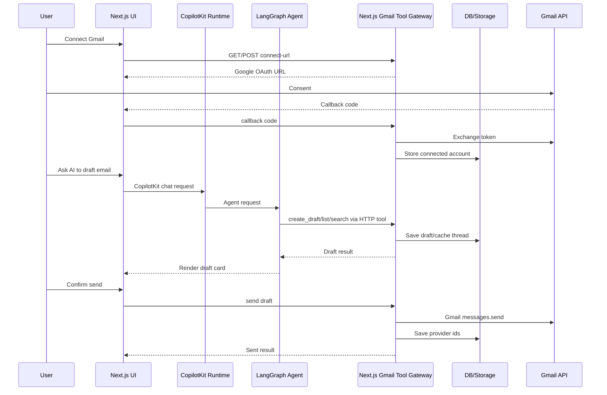

# Email/Gmail AI Implementation Handoff

## Mục Tiêu

Tài liệu này giao cho team nghiên cứu và implement feature Email/Gmail AI cho Phú Quốc Jobs theo hướng **demo-first, dễ làm, chạy được local trước**.

Feature Email/Gmail là kênh liên hệ chính thức ngoài app cho employer/candidate. Feature này không thay thế chat application hiện tại:

| Trạng thái application | Chat trong app | Email/Gmail |
|---|---|---|
| `PENDING` / `REVIEWING` | Không chat, candidate chỉ xem trạng thái CV | Chưa cần |
| `ACCEPTED` | Mở chat hai chiều ngắn trong app | Gửi lịch phỏng vấn, tài liệu, trao đổi chính thức |
| `REJECTED` | Employer để lại lời nhắn read-only, candidate không reply | Nếu cần liên hệ tiếp thì dùng email |
| `chatClosed` | Chỉ xem lịch sử, không nhắn tiếp | Email là kênh liên hệ tiếp theo |

V1 nên làm đủ 4 việc:

- Connect Gmail thật bằng Google OAuth.
- Xem/search email thread liên quan tuyển dụng.
- AI tạo draft từ context job/application/candidate.
- User xác nhận rồi mới gửi email thật.

## Hướng Khuyến Nghị Cho V1

Hướng dễ implement nhất cho đồ án/local demo:

```txt
CopilotKit UI / Email tab
  -> Next.js Email API routes / Gmail tool gateway
  -> Gmail API
```

Nếu dùng AI agent:

```txt
CopilotKit UI
  -> CopilotKit Runtime
  -> LangGraph recruiter agent
  -> LangChain tool gọi HTTP tới Next.js Gmail tool gateway
  -> Gmail API
```

Không cần làm MCP server chuẩn ở v1. MCP-style Gmail route là đủ để demo flow, dễ học từ source tham khảo, dễ debug bằng browser/network logs.

NestJS backend có thể tham gia ở phase production-hardening sau để gom permission/audit/token encryption chuẩn hơn.

## So Sánh 3 Hướng Tích Hợp

| Hướng | Mô tả | Ưu điểm | Nhược điểm | Khuyến nghị |
|---|---|---|---|---|
| A. MCP-style route như source tham khảo | Next.js route dạng JSON-RPC/tool gateway: `gmail_list_messages`, `gmail_create_draft`, `gmail_send_message` | Nhanh nhất, dễ copy ý tưởng, hợp local demo | Chưa phải MCP chuẩn, cần cẩn thận token/userId | **Chọn cho v1** |
| B. LangChain tools gọi NestJS Email API | Agent gọi tool HTTP tới NestJS, NestJS xử lý Gmail/token/permission | Sạch hơn cho production, đúng modular backend | Làm nhiều hơn, phải thêm module BE/API/schema kỹ hơn | Phase hardening |
| C. MCP server chuẩn TypeScript/Python | Tạo Gmail MCP server riêng, agent load qua `langchain-mcp-adapters` | Đẹp về tool gateway, mở rộng tốt | Phức tạp nhất, nhiều setup/debug | V2 nếu cần |

Kết luận: **v1 dùng Hướng A** để chạy được nhanh; tài liệu vẫn giữ đường nâng cấp sang B/C.

## Ý Tưởng Từ Source Tham Khảo

Source tham khảo: `/mnt/disk3/ai-personal-agent-main`.

Các phần đáng học:

- `app/api/gmail-connect/route.ts`: tạo Google OAuth URL/đổi code lấy token.
- `app/auth/gmail-callback/page.tsx`: callback UI sau khi Google consent.
- `app/api/gmail-mcp/route.ts`: route kiểu Gmail tool gateway.
- `app/api/ai-chat/route.ts`: AI nhận context Gmail/WhatsApp rồi trả lời.
- `app/api/briefings/ai-draft/route.ts`: AI tạo draft/briefing từ context.

`gmail-mcp` trong source tham khảo là **MCP-style JSON-RPC route**, không phải bắt buộc là MCP server chuẩn. Có thể học cách đặt action:

- `gmail_list_messages`
- `gmail_get_message`
- `gmail_get_thread`
- `gmail_search_messages`
- `gmail_create_draft`
- `gmail_send_message`

Không copy nguyên:

- Không lưu `accessToken`/`refreshToken` plaintext trong JSON field nếu hướng tới production.
- Không tin `userId` FE gửi lên nếu đã có session/auth.
- Không để simulated send báo như gửi Gmail thật.
- Không xin scope rộng như `gmail.modify` nếu chưa cần.
- Không để AI tự gửi email.

## Luồng User

1. Employer/candidate mở tab Email hoặc hỏi CopilotKit agent.
2. Nếu chưa connect Gmail, user bấm "Kết nối Gmail".
3. FE gọi route tạo Google OAuth URL.
4. User consent trên Google.
5. Google callback trả `code`.
6. Route callback đổi `code` lấy token và lưu connected account.
7. UI hiển thị Gmail đã kết nối.
8. User xem/search thread tuyển dụng.
9. User yêu cầu AI soạn email, ví dụ: "Soạn email mời phỏng vấn ứng viên này".
10. AI tạo draft từ context application/candidate/job.
11. UI hiển thị draft để user đọc/sửa.
12. User bấm xác nhận gửi.
13. Route gửi email gọi Gmail API.
14. DB lưu `providerMessageId`, `providerThreadId`, `sentAt`.

## CopilotKit Và Human Confirmation

CopilotKit có thể hỗ trợ confirmation theo nhiều cách:

- `useFrontendTool`: agent gọi tool ở browser để mở draft/confirm dialog.
- Rendered tool call: agent trả draft và FE render card có nút "Gửi".
- Human-in-the-loop confirmation: agent dừng chờ user approve.
- Email tab riêng: agent chỉ tạo draft, user sang tab Email để gửi.

Rule bắt buộc:

- AI chỉ tạo draft, không tự gửi.
- Nếu user nói "gửi ngay", UI vẫn phải hỏi xác nhận một lần.
- Tool nên tách 2 bước:
  - `create_draft`: tạo draft.
  - `confirm_send`: chỉ chạy sau khi user approve.
- Không expose tool gửi thật để LLM tự gọi không qua xác nhận.

Luồng gợi ý:

```txt
User asks CopilotKit agent
  -> Agent calls create_draft tool
  -> FE renders draft card
  -> User clicks Send
  -> FE calls confirm_send route
  -> Gmail API sends email
```

## Kiến Trúc V1 Demo-First



## Đường Nâng Cấp Production

Sau khi demo chạy ổn, có thể nâng cấp theo 2 hướng:

### Phase 2A: Đưa Gmail Về NestJS

```txt
CopilotKit/LangGraph tool
  -> NestJS Email API
  -> Gmail API
```

NestJS xử lý:

- auth/session,
- permission theo application/job/company,
- token encryption,
- audit log,
- rate limit,
- notification,
- DB schema/migration chuẩn.

### Phase 2B: MCP Server Chuẩn

```txt
LangGraph Agent
  -> langchain-mcp-adapters
  -> Gmail MCP Server
  -> NestJS Email API hoặc Gmail API qua token broker
```

Chỉ nên làm khi team thật sự cần tool gateway chuẩn cho nhiều agent/tool khác nhau. Nếu chỉ cần Gmail demo thì v1 MCP-style route đủ tốt hơn.

## Schema Tối Thiểu

V1 có thể dùng các bảng/collection tương đương:

```prisma
model ConnectedEmailAccount {
  id                    String   @id @default(cuid())
  userId                String
  provider              String   // gmail
  email                 String
  refreshTokenEncrypted String
  accessTokenEncrypted  String?
  accessTokenExpiresAt  DateTime?
  scopes                String?
  syncCursor            String?
  isActive              Boolean  @default(true)
  createdAt             DateTime @default(now())
  updatedAt             DateTime @updatedAt
}

model EmailThread {
  id                  String   @id @default(cuid())
  accountId           String
  providerThreadId    String
  subject             String?
  participants        Json?
  linkedApplicationId String?
  lastMessageAt       DateTime?
  createdAt           DateTime @default(now())
  updatedAt           DateTime @updatedAt
}

model EmailMessage {
  id                String   @id @default(cuid())
  threadId          String
  providerMessageId String
  from              String?
  to                Json?
  cc                Json?
  subject           String?
  snippet           String?
  bodyText          String?
  sentAt            DateTime?
  createdAt         DateTime @default(now())
}

model EmailDraft {
  id            String   @id @default(cuid())
  userId        String
  threadId      String?
  applicationId String?
  to            Json
  subject       String
  body          String
  aiGenerated   Boolean  @default(false)
  status        String   @default("DRAFT")
  createdAt     DateTime @default(now())
  updatedAt     DateTime @updatedAt
}
```

Ghi chú:

- Demo local có thể bắt đầu đơn giản hơn, nhưng production phải mã hoá token.
- Email gửi thật phải lưu `providerMessageId/providerThreadId`.
- Simulated draft/send phải có status riêng, không trộn với Gmail gửi thật.

## API / Tool Actions Tối Thiểu

Dạng REST hoặc JSON-RPC đều được. Nếu làm theo source tham khảo, có thể dùng JSON-RPC style:

- `gmail_connect_url`
- `gmail_callback`
- `gmail_accounts`
- `gmail_revoke_account`
- `gmail_list_messages`
- `gmail_get_message`
- `gmail_get_thread`
- `gmail_search_messages`
- `gmail_create_draft`
- `gmail_send_draft`

Nếu làm REST:

- `POST /api/email/gmail/connect-url`
- `POST /api/email/gmail/callback`
- `GET /api/email/accounts`
- `POST /api/email/accounts/:id/revoke`
- `GET /api/email/threads`
- `GET /api/email/threads/:id/messages`
- `POST /api/email/drafts/ai`
- `POST /api/email/drafts/:id/send`

Contract quan trọng:

- Không trả token về FE.
- Không lấy `userId` từ FE nếu đã có session.
- Send response phải phân biệt:
  - `DRAFT_CREATED`
  - `SENT_BY_GMAIL_API`
  - `SIMULATED_LOCAL_ONLY`

## Gmail Scopes

Xin quyền theo tính năng:

- Cơ bản: `openid`, `email`, `profile`.
- Đọc/search inbox: Gmail readonly/metadata scope.
- Tạo nháp: Gmail compose scope.
- Gửi email: Gmail send scope.

Không xin quyền rộng nếu chưa dùng. Nếu thiếu scope, UI phải báo rõ cần reconnect Gmail với quyền phù hợp.

## AI Draft Behavior

Context nên đưa cho AI:

- job title,
- company name,
- candidate name/email,
- application status,
- employer message nếu có,
- CV summary ngắn,
- email thread đang mở,
- vai trò người viết: employer hoặc candidate.

AI output:

- subject,
- body,
- recipients,
- tone,
- reason/context ngắn để user biết vì sao draft được tạo.

AI không được tự gửi.

## Local Test Checklist

1. Tạo Google OAuth client.
2. Thêm redirect URI local.
3. Enable Gmail API đúng Google Cloud project.
4. Nếu OAuth app ở Testing, thêm email tester.
5. Connect Gmail phụ, không dùng Gmail chính.
6. Gửi email test từ tài khoản khác.
7. Test list/search/get thread.
8. Test AI create draft.
9. Test confirmation UI.
10. Test send thật và kiểm tra Gmail Sent.
11. Test revoke account.
12. Test simulated mode phải ghi rõ không gửi thật.

## Lỗi Hay Gặp Khi Test

- `Error 403: access_denied`: OAuth app ở Testing nhưng email chưa nằm trong Test users.
- `SERVICE_DISABLED`: Gmail API chưa enable hoặc enable sai Google Cloud project.
- `No refresh token provided`: session/token cũ hoặc OAuth chưa trả refresh token; revoke app permission rồi connect lại.
- Gemini/OpenAI model lỗi tải cao: cần retry/fallback model/fallback template.
- Simulated mode dễ gây hiểu nhầm: UI phải nói rõ chưa gửi Gmail thật.
- Nếu dùng Trigger/local job: task thủ công cần payload đúng.

## Acceptance Checklist

- User email/password connect được Gmail.
- User Google-login vẫn connect/reconnect Gmail được.
- Connected Gmail khác login email được hiển thị rõ.
- FE không nhận token.
- AI tạo được email draft từ application/job/candidate context.
- User phải confirm trước khi gửi thật.
- Email gửi thật lưu provider ids và xuất hiện trong Gmail Sent.
- Simulated send không được báo là Gmail sent.
- Gmail API disabled có hướng dẫn rõ.
- OAuth Testing có hướng dẫn thêm test users.
- Tài liệu ghi rõ v1 là MCP-style route, MCP server chuẩn để v2.
