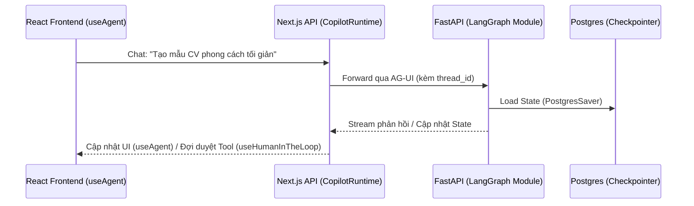

# Hướng dẫn Phát triển AI Agent Sinh CV Template (LangGraph + CopilotKit v2)

Tài liệu này là đặc tả kỹ thuật (Technical Spec) dành cho **AI/Backend Developer**. 
Mục tiêu: Xây dựng AI Agent hoạt động như một Chuyên gia Thiết kế CV (Claude-like UX) với giao tiếp Stateful Multi-Turn.

> [!IMPORTANT]
> **Yêu cầu Kiến trúc (Làm việc Teamwork):** 
> Vì dự án làm theo team và cần dễ dàng hợp nhất code (merge code), phần Agent (Python) **KHÔNG ĐƯỢC viết tuột luốt (hard-code) vào 1 file**. Phải chia module rõ ràng, giống triết lý của NestJS (Mỗi domain/chức năng là 1 folder/module độc lập).

---

## 1. Đề xuất Cấu trúc Thư mục (Modular Architecture)

Khuyến nghị xây dựng server Python (FastAPI + LangGraph) theo chuẩn Modular:

```text
ai_agent_server/
├── main.py                  # Entry point (FastAPI Server + AG-UI config)
├── database/
│   └── checkpointer.py      # Cấu hình PostgresSaver cho LangGraph
├── modules/
│   └── cv_builder/          # Module (Domain) riêng cho tính năng CV
│       ├── __init__.py
│       ├── state.py         # Định nghĩa AgentState, TemplateRequirements
│       ├── graph.py         # Khởi tạo StateGraph, add_node, add_edge
│       ├── nodes/           # Tách mỗi node thành 1 file riêng
│       │   ├── __init__.py
│       │   ├── interview.py # Node giao tiếp, hỏi đáp thu thập yêu cầu
│       │   └── generate.py  # Node Heavy-duty gọi LLM sinh HTML/CSS
│       ├── tools/           # Các công cụ gọi DB
│       │   ├── __init__.py
│       │   └── save_db.py   # Tool lưu HTML/CSS vào ResumeTemplate (Postgres)
│       └── prompts.py       # Tách riêng System Prompts, không hardcode vào logic
└── requirements.txt
```

Việc chia nhỏ `state`, `graph`, `nodes`, `tools` giúp các thành viên trong team AI (nếu có) có thể code song song mà không bị conflict khi Git Merge.

---

## 2. Giao tiếp qua AG-UI Protocol

Hệ thống sử dụng **AG-UI Protocol** nối Next.js Frontend với server Python FastAPI.



**File `main.py` (FastAPI Server):**
Sử dụng thư viện adapter của CopilotKit (ví dụ `ag-ui-langgraph`) để bọc cái `graph` đã compile từ module `cv_builder` thành một endpoint (vd: port 8123).

---

## 3. Đặc tả Kỹ thuật của Module `cv_builder`

### 3.1. Định nghĩa State (`state.py`)
StateGraph cần lưu trữ các trường dữ liệu để phục vụ Multi-Turn Interview.
```python
from typing import TypedDict, Optional
from typing_extensions import Annotated
import operator

class TemplateRequirements(TypedDict):
    industry: Optional[str]
    style: Optional[str]
    primary_color: Optional[str]
    layout: Optional[str]

class AgentState(TypedDict):
    messages: Annotated[list, operator.add]
    requirements: TemplateRequirements
    is_ready_to_generate: bool   # Cờ đánh dấu đã hỏi đủ thông tin
```

### 3.2. Node: Phỏng vấn thu thập yêu cầu (`nodes/interview.py`)
- **Nhiệm vụ:** Phân tích `messages` cuối cùng. Map dữ liệu vào `requirements`.
- Nếu `requirements` thiếu, LLM sinh câu hỏi thân thiện (vd: *"Bạn thích CV tông sáng hay tối?"*). 
- Nếu đủ 4 trường, set `is_ready_to_generate = True`.

### 3.3. Node: Sinh Code (`nodes/generate.py`)
Chỉ kích hoạt khi `is_ready_to_generate == True`.
> [!WARNING]
> **Quy tắc LLM Sinh Code khắt khe (Bắt buộc truyền vào System Prompt):**
> 1. Phải có `{{name}}`, `{{summary}}`... để FE map data.
> 2. Phải dùng `data-repeat="experience"` cho danh sách.
> 3. Phải dùng `data-field="..."` cho các thẻ text để FE có thể làm chức năng Inline Edit.
> 4. Không dùng `<script>`, `<iframe>` (Chống XSS).

### 3.4. Cấu hình Graph (`graph.py`)
Biên dịch Graph và NHẤT ĐỊNH phải sử dụng `PostgresSaver`.
```python
from langgraph.graph import StateGraph, START, END
from langgraph.checkpoint.postgres import PostgresSaver

builder = StateGraph(AgentState)
builder.add_node("interview", interview_node)
builder.add_node("generate", generate_node)
# Thêm logic điều hướng conditional edge dựa trên is_ready_to_generate
# ...

# Phải cấu hình checkpointer cho Production
# checkpointer = PostgresSaver.from_conn_string(DATABASE_URL)
# graph = builder.compile(checkpointer=checkpointer)
```

---

## 4. Bắt tay với Frontend (Sử dụng CopilotKit Hooks)

Đảm bảo bạn báo cho team Frontend cấu trúc State (`AgentState`) để họ gọi hook bên React.

**Bên React Frontend sẽ làm 2 việc dựa trên Module AI này:**
1. **Theo dõi tiến trình:** Dùng `useAgent({ name: "cv_designer" })` để đọc `state.requirements` hiển thị Checklist cho user.
2. **Human-in-the-Loop:** Dùng `useHumanInTheLoop({ name: "save_template_to_db" })`. Khi Agent gọi tool lưu DB, luồng sẽ bị khựng lại chờ User bên FE nhấn nút "Duyệt". Nếu duyệt, tool chạy. Nếu user huỷ, truyền lý do reject về lại cho Agent để Agent tự sửa (`nodes/generate.py` chạy lại).
