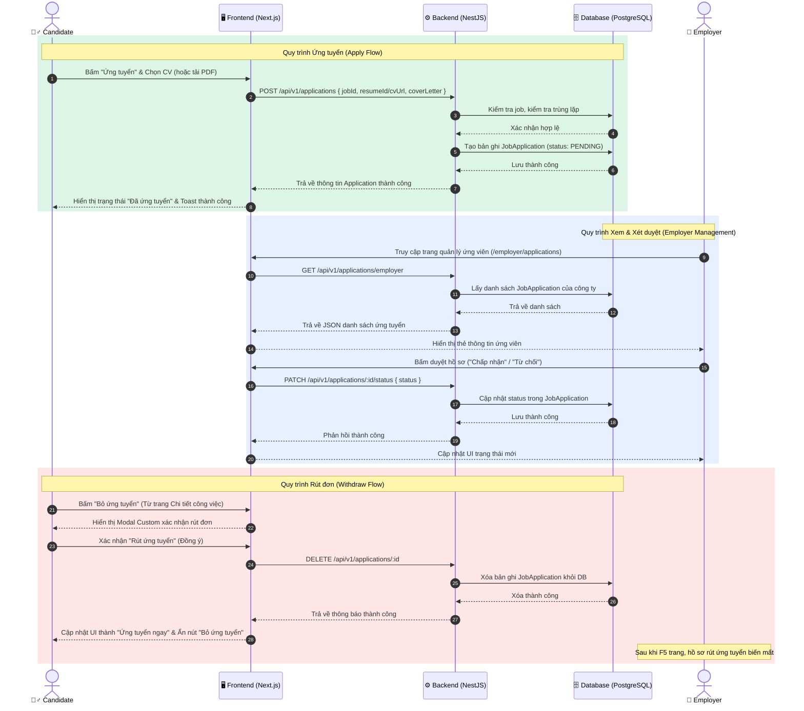

# Tài liệu cập nhật tính năng CV - PQJobs

Tài liệu này ghi nhận các thay đổi kỹ thuật để hỗ trợ tạo, chỉnh sửa trực quan và lưu trữ độc lập thông tin liên hệ (Họ tên, Ảnh đại diện, Điện thoại, Email) cho từng bản CV (không bị ghi đè và lưu chung giữa các CV của cùng một tài khoản).

---

## 1. Cập nhật Cơ sở Dữ liệu (Prisma Schema)

Bổ sung các trường thông tin liên hệ trực tiếp vào bảng `CandidateResume` (`candidate_resume`) để lưu riêng biệt cho mỗi CV:

File: [backend/prisma/schema.prisma](file:///c:/Users/ngoan/Documents/thuctapsinh/job-PhuQuoc/backend/prisma/schema.prisma)
```prisma
model CandidateResume {
  id          String   @id @default(cuid())
  userId      String
  title       String   @default("Hồ sơ của tôi")
  address     String?
  summary     String?
  socialLinks Json?
  education   Json?
  experience  Json?
  projects    Json?
  skills      String?
  degree      String?
  languages   String?
  
  // Bổ sung các trường lưu độc lập cho từng CV
  name        String?
  email       String?
  phone       String?
  avatar      String?

  isDefault   Boolean  @default(false)
  templateId  String
  createdAt   DateTime @default(now())
  updatedAt   DateTime @updatedAt

  user         user           @relation(fields: [userId], references: [id], onDelete: Cascade)
  template     ResumeTemplate @relation(fields: [templateId], references: [id], onDelete: Cascade)
  applications JobApplication[]

  @@index([userId])
  @@map("candidate_resume")
}
```

---

## 2. Cập nhật Backend (NestJS)

### DTO validation:
Bổ sung khai báo các trường `name`, `email`, `phone`, `avatar` vào `CreateResumeDto` và `UpdateResumeDto` để bộ lọc NestJS chấp nhận dữ liệu gửi lên.
* File: [resume.dto.ts](file:///c:/Users/ngoan/Documents/thuctapsinh/job-PhuQuoc/backend/src/modules/resumes/dto/resume.dto.ts)

### Service query:
Cập nhật hàm `findById` trong `resumes.service.ts` để luôn tải kèm thông tin `user` liên kết làm dữ liệu mặc định.
* File: [resumes.service.ts](file:///c:/Users/ngoan/Documents/thuctapsinh/job-PhuQuoc/backend/src/modules/resumes/resumes.service.ts)

---

## 3. Cập nhật Frontend (Next.js)

### Nạp dữ liệu CV ưu tiên độc lập:
* Cập nhật cả trang xem chi tiết và trang chỉnh sửa để lấy dữ liệu liên hệ từ bản ghi CV trước, nếu không có mới lấy thông tin mặc định từ tài khoản người dùng (`r.user`).
* File cấu hình chỉnh sửa: [edit/page.tsx](file:///c:/Users/ngoan/Documents/thuctapsinh/job-PhuQuoc/web/src/app/candidate/resumes/[id]/edit/page.tsx)
* File cấu hình hiển thị: [page.tsx](file:///c:/Users/ngoan/Documents/thuctapsinh/job-PhuQuoc/web/src/app/candidate/resumes/[id]/page.tsx)

### Độc lập hoá nút "Lưu thay đổi" & "Đổi ảnh":
* Toàn bộ 6 mẫu CV thiết kế (Classic, Modern, Creative, Elegant, Futuristic, Minimalist Modern) trong [web/src/template](file:///c:/Users/ngoan/Documents/thuctapsinh/job-PhuQuoc/web/src/template) đã được điều chỉnh:
  1. Không gọi `PATCH /api/v1/auth/me` để tránh ghi đè thông tin tài khoản dùng chung.
  2. Gửi thẳng `name`, `email`, `phone`, `avatar` trực tiếp vào payload lưu trữ của CV đó qua API. Nếu là CV mới (chưa có `resumeId`), gửi yêu cầu `POST /api/v1/resumes`, ngược lại gửi `PATCH /api/v1/resumes/${resumeId}`.
  3. Xử lý tải ảnh đại diện bằng `FileReader` chuyển sang dạng Base64 Data URL, lưu trữ an toàn trong DB thay vì URL tạm thời (`blob:`).
  4. Tự động chuyển hướng về trang danh sách CV `/candidate/resumes` ngay khi lưu thành công.

### Quy trình tạo CV mới (Chỉ lưu khi bấm nút Lưu):
* Khi chọn mẫu CV ở trang `templates/page.tsx`, người dùng được chuyển hướng trực tiếp đến `/candidate/resumes/new?templateId=tpl-...` thay vì gửi API POST tạo nháp trước.
* Trang `/candidate/resumes/new` sẽ kết xuất mẫu CV trực tiếp trên client với thông tin mặc định tải từ trang cá nhân của tài khoản (`/api/v1/auth/me`). Khi người dùng bấm **Lưu thay đổi** lần đầu tiên, CV mới được chính thức tạo và lưu vào CSDL.

### Sửa lỗi không xóa được CV:
* Cập nhật API Proxy Route [route.ts](file:///c:/Users/ngoan/Documents/thuctapsinh/job-PhuQuoc/web/src/app/api/v1/[...slug]/route.ts) để tránh gọi hàm `request.text()` cho phương thức `DELETE`. Việc gọi `request.text()` trên các yêu cầu `DELETE` không chứa body (thân tin nhắn) đã gây treo proxy, dẫn đến không xóa được CV từ trang chi tiết.

---

## 4. Quy trình Ứng tuyển & Rút đơn ứng tuyển (Candidate & Employer)

Dưới đây mô tả chi tiết luồng xử lý và dữ liệu trao đổi giữa ứng viên (Candidate) và nhà tuyển dụng (Employer) khi nộp hồ sơ hoặc rút hồ sơ ứng tuyển:

### 4.1. Chi tiết luồng xử lý

* **Ứng tuyển (Apply Flow):**
  1. Candidate truy cập trang chi tiết công việc, chọn **Ứng tuyển ngay**.
  2. Lựa chọn CV có sẵn hoặc upload PDF, điền thư giới thiệu (tùy chọn).
  3. Gửi đơn ứng tuyển: FE gọi `POST /api/v1/applications`.
  4. BE kiểm tra tính hợp lệ của công việc, xác thực vai trò ứng viên, kiểm tra trùng lặp (chỉ được nộp 1 lần/công việc).
  5. BE lưu bản ghi ứng tuyển vào bảng `JobApplication` trong Database với trạng thái mặc định là `PENDING` (Chờ xem).

* **Xem & Xét duyệt (Employer Management):**
  1. Employer truy cập trang **Hồ sơ ứng viên** (`/employer/applications`).
  2. FE gọi `GET /api/v1/applications/employer` để lấy danh sách hồ sơ ứng tuyển liên kết với công ty.
  3. Employer có thể xem CV chi tiết (PDF/Web preview), đánh dấu bookmark, hoặc xét duyệt trạng thái ứng viên (Duyệt/Từ chối): FE gọi `PATCH /api/v1/applications/:id/status` lưu thẳng vào Database.

* **Rút đơn ứng tuyển (Withdraw Flow):**
  1. Khi đã ứng tuyển, trang chi tiết công việc hiển thị trạng thái **Đã ứng tuyển** cùng nút đỏ **Bỏ ứng tuyển**.
  2. Bấm **Bỏ ứng tuyển**: FE hiển thị một **Modal xác nhận rút hồ sơ (Custom Modal)** tuyệt đẹp để xác nhận lại ý định của người dùng.
  3. Xác nhận đồng ý: FE gọi `DELETE /api/v1/applications/:id`.
  4. BE kiểm tra quyền sở hữu đơn nộp và xóa hoàn toàn dòng dữ liệu `JobApplication` ra khỏi CSDL PostgreSQL.
  5. UI của Candidate lập tức cập nhật trạng thái về **Ứng tuyển ngay**.
  6. Giao diện của Employer sẽ không còn hiển thị hồ sơ ứng viên này nữa sau khi **Làm mới trang (F5)** (do bản ghi đã bị xóa vĩnh viễn khỏi Database).

### 4.2. Sơ đồ tuần tự (Sequence Diagram)



