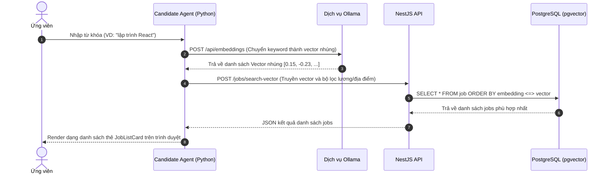
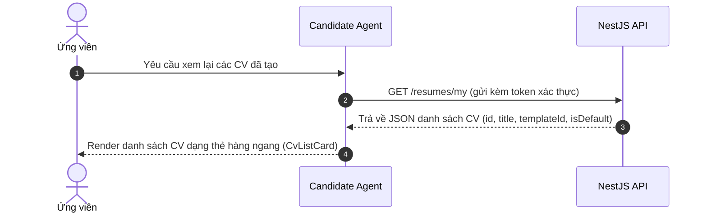
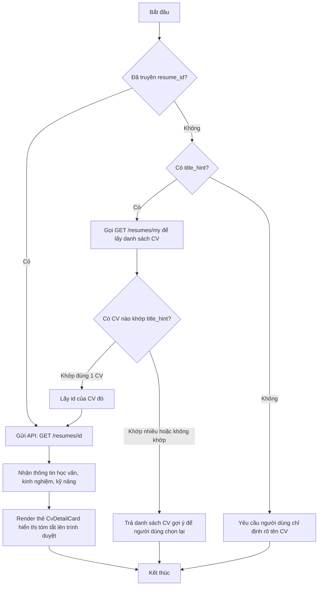
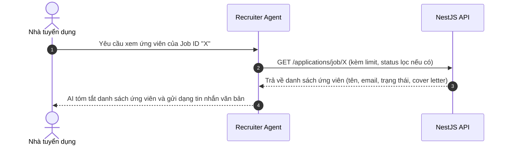
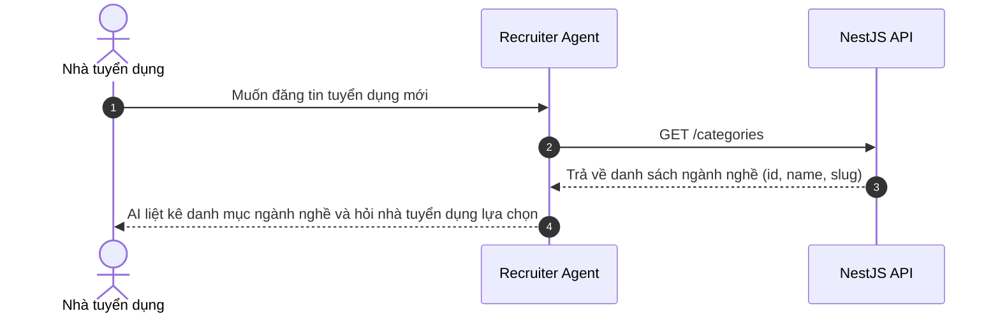
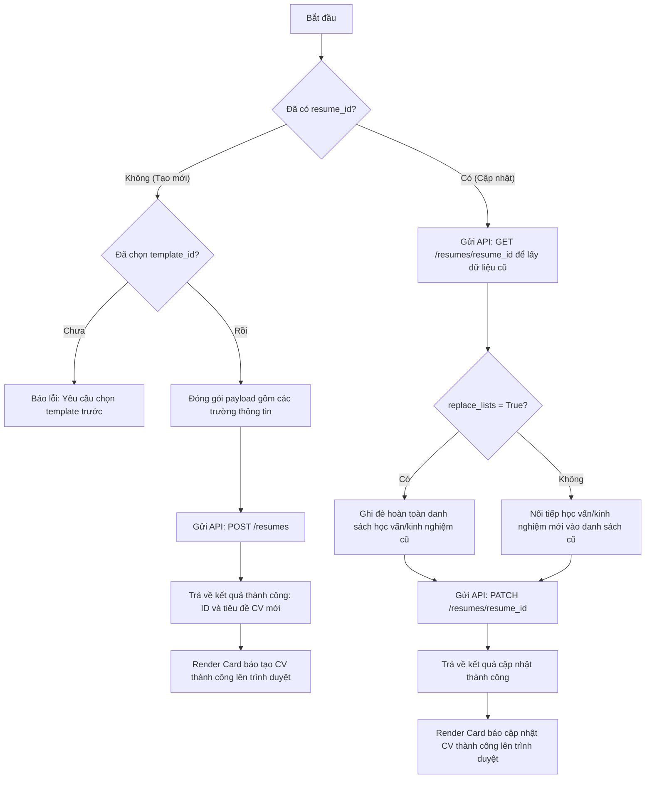
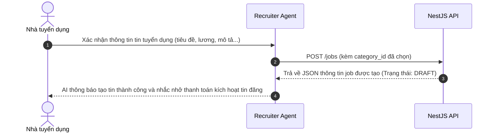
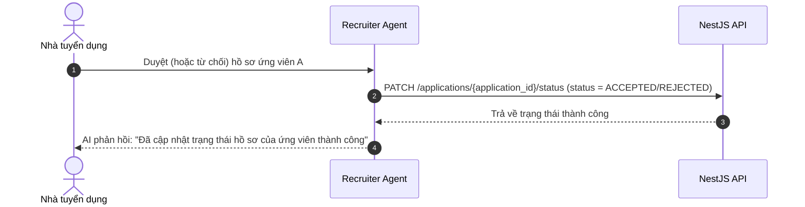
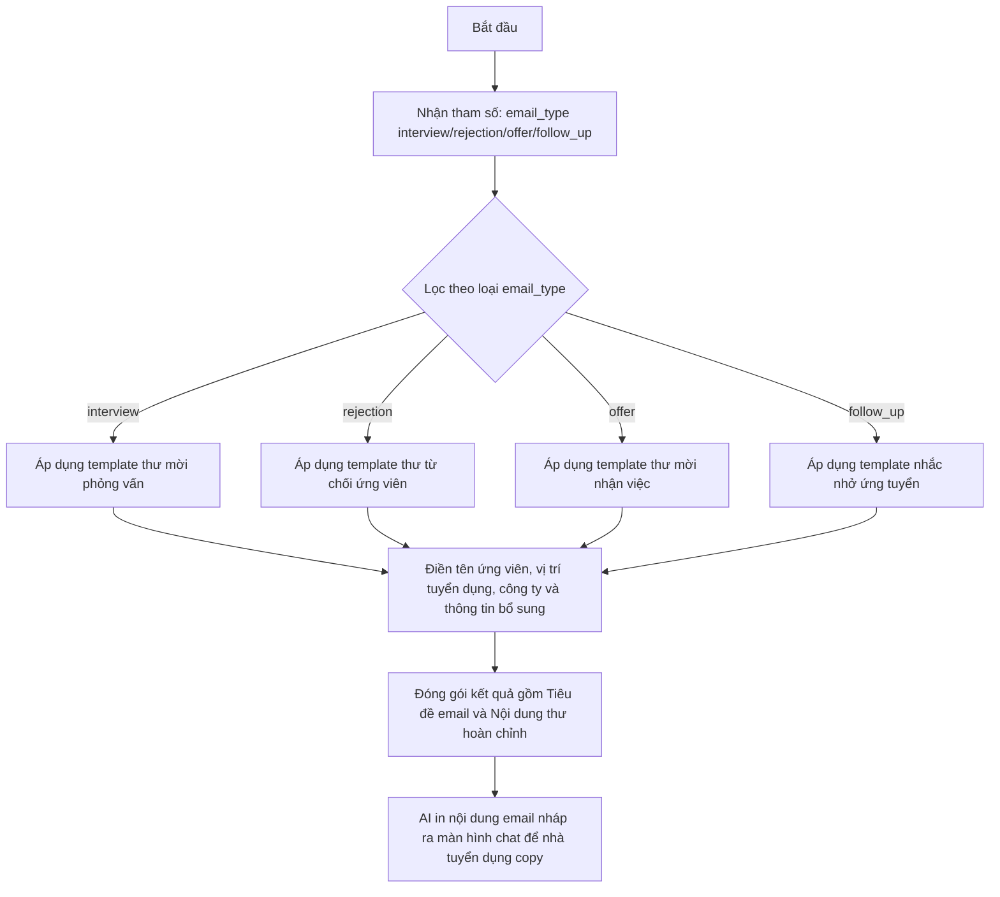
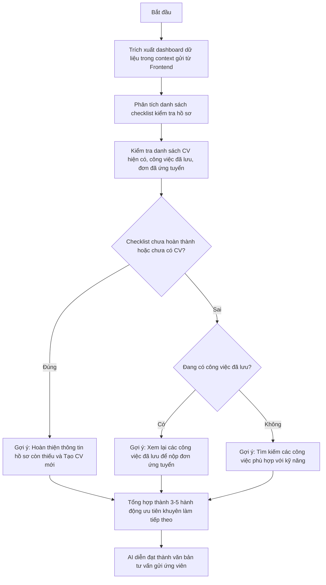

# SƠ ĐỒ HOẠT ĐỘNG CHI TIẾT TỪNG TOOL CỦA AI AGENT

Tài liệu này mô tả chi tiết quy trình xử lý dữ liệu và luồng hoạt động (workflow) của từng công cụ (tool) được xây dựng trong hệ thống Agent.

---

## I. NHÓM 1: CÁC TOOL TÌM KIẾM & TRUY XUẤT DỮ LIỆU (READ-ONLY TOOLS)

### 1. Tool `search_jobs` (Tìm kiếm việc làm ngữ nghĩa)
Tool này sử dụng công nghệ tìm kiếm vector (vector search) để so khớp công việc theo ngữ nghĩa thay vì chỉ tìm từ khóa thô.



---

### 2. Tool `list_my_cvs` (Xem danh sách CV đã lưu)
Truy xuất danh sách tất cả các bản CV mà ứng viên hiện tại đang sở hữu.



---

### 3. Tool `get_cv_detail` (Xem chi tiết một bản CV)
Lấy nội dung chi tiết của một CV cụ thể để đọc hoặc chuẩn bị chỉnh sửa.



---

### 4. Tool `get_candidates` (Xem hồ sơ ứng viên nộp đơn - Recruiter)
Dành cho nhà tuyển dụng xem danh sách các ứng viên đã nộp đơn vào tin tuyển dụng.



---

### 5. Tool `get_categories` (Lấy danh mục ngành nghề - Recruiter)
Lấy danh sách danh mục để điền đúng thông tin ngành nghề khi tạo tin đăng tuyển mới.



---

## II. NHÓM 2: CÁC TOOL TẠO MỚI & CẬP NHẬT DỮ LIỆU (WRITE/UPDATE TOOLS)

### 6. Tool `save_cv` (Tạo mới hoặc chỉnh sửa cập nhật CV)
Quản lý luồng lưu trữ dữ liệu CV của ứng viên.



---

### 7. Tool `choose_cv_template` (Lấy và chọn mẫu giao diện CV)
Bắt buộc gọi trước khi tạo mới CV nhằm xác định giao diện hiển thị.

```mermaid
graph TD
    A[Bắt đầu] --> B[Gọi API: GET /resumes/templates]
    B --> C{Lần gọi đầu tiên (Style/Index đều trống)?}

    C -- Đúng --> D[Trả về danh sách mẫu kèm cờ need_user_choice=True]
    D --> E[AI liệt kê danh sách đánh số thứ tự và hỏi ý kiến ứng viên]

    C -- Sai --> F{User chọn theo Số thứ tự index?}
    F -- Đúng --> G[Khớp mẫu theo vị trí trong danh sách]
    F -- Không --> H{User chọn theo tên style?}
    H -- Đúng --> I[So khớp ký tự gần đúng trong tên/mô tả mẫu]
    H -- Không --> J[Nếu user đồng ý cho AI tự chọn -> Lấy mẫu mặc định đầu tiên]

    G & I & J --> K{Khớp thành công?}
    K -- Đúng --> L[Trả về template_id và template_name]
    K -- Không --> D
```

---

### 8. Tool `create_job` (Đăng tin tuyển dụng - Recruiter)
Nhà tuyển dụng thiết lập thông tin và đăng tin tuyển dụng.



---

### 9. Tool `update_application_status` (Duyệt/Từ chối hồ sơ - Recruiter)
Cập nhật trạng thái duyệt đơn ứng tuyển của các ứng viên.



---

## III. NHÓM 3: CÁC TOOL LOGIC CỤC BỘ (IN-MEMORY TOOLS)

### 10. Tool `draft_email` (Soạn email mẫu gửi ứng viên)
Hỗ trợ soạn thảo nhanh văn bản email theo các sự kiện ứng tuyển.



---

### 11. Tool `analyze_candidate_dashboard` (Phân tích Dashboard gợi ý hành động)
Phân tích hiện trạng hồ sơ cá nhân của ứng viên để đưa ra lời khuyên tìm việc.


